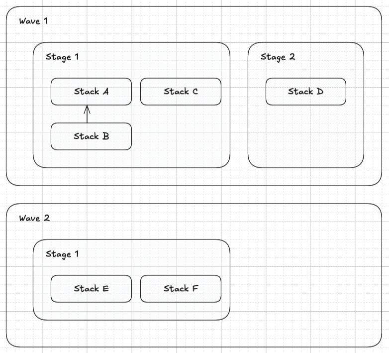
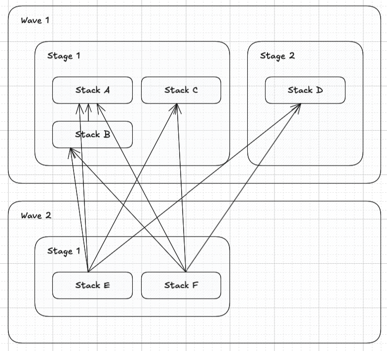
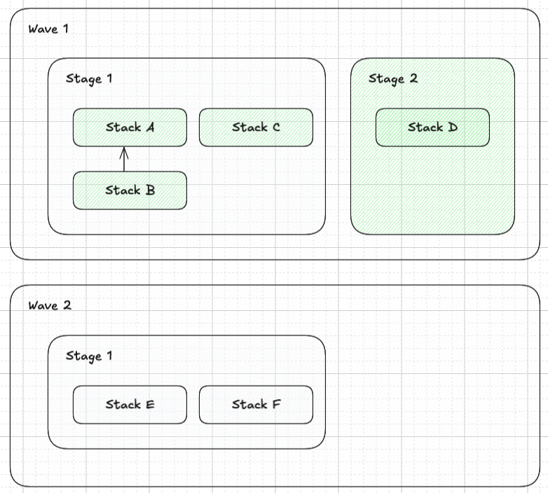
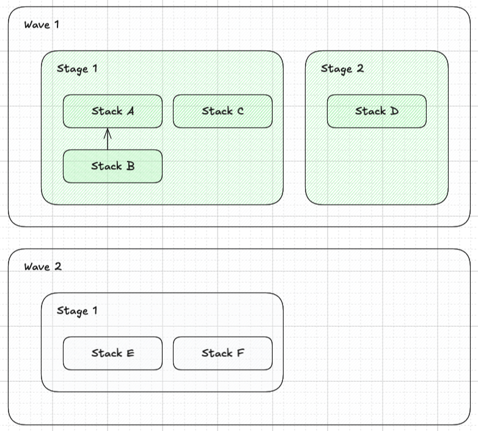

# CDK Express Pipelines

## Introduction

CDK Express Pipelines is a library that allows you to define your pipelines in CDK native method. It is built on
top of the [AWS CDK](https://aws.amazon.com/cdk/) and is an alternative
to [AWS CDK Pipelines](https://aws.amazon.com/cdk/pipelines/)
that is build system agnostic.

## Features

- Works on any system for example your local machine, GitHub, GitLab, etc.
- Uses the `cdk deploy` command to deploy your stacks
- Make use of concurrent/parallel Stack deployments
- Stages and Waves are plain classes, not constructs, they do not change nested Construct IDs (like CDK Pipelines)
- Supports TS and Python CDK

## How does it work?

This library makes use of the fact that the CDK CLI computes the dependency graph of your stacks and deploys them in
the correct order. It creates the correct dependency graph between Waves, Stages and Stacks with the help of the
native `.addDependency` method of the CDK Stack. The `cdk deploy '**'` command will deploy all stacks in the correct
order.

## Deployment Order

The Wave, Stage and Stack order is as follows:

- Waves are deployed sequentially, one after the other.
- Stages within a Wave are deployed in parallel.
- Stacks within a Stage are deployed in order of stack dependencies within a Stage.

For example, the following definition of Waves, Stages and Stacks as in CDK Express Pipelines:



Will create a dependency graph as follows:



When used with `cdk deploy '**' --concurrency 10`, it will deploy all stacks in parallel, 10 at a time, where possible
while still adhering to the dependency graph. Stacks will be deployed in the following order:

<details>
<summary>✨ Deployment order visualized ✨</summary>







</details>

## Selective Deployment

Leverages a consistent and predictable naming convention for Stack IDs. A Stack ID consists of the Wave, Stage and
original Stack ID. This enables us to target Waves, Stages or individual stacks for deployment. For example, given the
following stack IDs:

```
Wave1_Stage1_StackA
Wave1_Stage1_StackB
Wave1_Stage1_StackC
Wave1_Stage2_StackD

Wave2_Stage1_StackE
Wave2_Stage1_StackF
```

It makes targeted deployments easy:

- Deploy Wave1: `cdk deploy 'Wave1_*'` deploys all stacks in `Wave1`
- Deploy Wave1 Stage1: `cdk deploy 'Wave1_Stage1_*'` deploys all stacks in `Wave1_Stage1`
- Deploy Wave1 Stage1 StackA: `cdk deploy 'Wave1_Stage1_StackA'` deploys only `Wave1_Stage1_StackA`

> [!IMPORTANT]
> When targeting specific stacks be sure to pass the `--exclusively` flag to the `cdk deploy` command to only deploy
> the specified stacks and not its dependencies.

Benefits of selecting a specific Wave, Stage or Stack over the all `'**'` method:

- While developing, you can speed up deployments from your local machine by deploying only what you are working on.
- When deploying with a CI/CD system, you can have additional logic between them. For example, you can place a
  manual approval step between `Wave1` and `Wave2`.

## Installation

### TS

```bash
npm install cdk-express-pipelines
```

Then import the library in your code:

```typescript
import { CdkExpressPipeline } from 'cdk-express-pipelines';
```

### Python

```bash
pip install cdk-express-pipelines
```

Then import the library in your code:

```python
from cdk_express_pipelines import CdkExpressPipeline
```

## Usage

The `ExpressStack` extends the `cdk.Stack` class and has a very similar signature, only taking an extra `stage`
parameter. There ara multiple ways to build your pipeline, it involves creating the Pipeline, adding Waves, Stages and
Stacks to your Stages and then calling `.synth()` on the Pipeline. See the alternative expand sections for other
methods.

**Stack Definition:**

```typescript
  class StackA extends ExpressStack {
  constructor(scope: Construct, id: string, stage: ExpressStage, stackProps?: StackProps) {
    super(scope, id, stage, stackProps);

    new cdk.aws_sns.Topic(this, 'MyTopic');
    // ... more resources
  }
}

class StackB extends ExpressStack {
  //... similar to StackA
}

class StackC extends ExpressStack {
  //... similar to StackA
}
```

**1️⃣ Pipeline Definition:**

```typescript
const app = new App();
const expressPipeline = new CdkExpressPipeline();

// === Wave 1 ===
const wave1 = expressPipeline.addWave('Wave1');
// --- Wave 1, Stage 1---
const wave1Stage1 = wave1.addStage('Stage1');

const stackA = new StackA(app, 'StackA', wave1Stage1);
const stackB = new StackB(app, 'StackB', wave1Stage1);
stackB.addExpressDependency(stackA);

// === Wave 2 ===
const wave2 = expressPipeline.addWave('Wave2');
// --- Wave 2, Stage 1---
const wave2Stage1 = wave2.addStage('Stage1');
new StackC(app, 'StackC', wave2Stage1);
expressPipeline.synth([
  wave1,
  wave2,
]);
```

The stack deployment order will be printed to the console when running `cdk` commands:

```plaintext
ORDER OF DEPLOYMENT
🌊 Waves  - Deployed sequentially
🔲 Stages - Deployed in parallel, all stages within a wave are deployed at the same time
📄 Stack  - Dependency driven, will be deployed after all its dependent stacks, denoted by ↳ below it, is deployed

🌊 Wave1
  🔲 Stage1
    📄 StackA (Wave1_Stage1_StackA)
    📄 StackB (Wave1_Stage1_StackB)
        ↳ StackA
🌊 Wave2
  🔲 Stage1
    📄 StackC (Wave2_Stage1_StackC)

```

<details>
<summary>**2️⃣ Pipeline Definition Alternative - Stacks Nested in Stages:**</summary>

```typescript
const app = new App();

class Wave1 extends ExpressWave {
  constructor() {
    super('Wave1');
  }
}

class Wave1Stage1 extends ExpressStage {
  constructor(wave1: Wave1) {
    super('Stage1', wave1);

    const stackA = new StackA(app, 'StackA', this);
    const stackB = new StackB(app, 'StackB', this);
    stackB.addExpressDependency(stackA);
  }
}

class Wave2 extends ExpressWave {
  constructor() {
    super('Wave2');
  }
}

class Wave2Stage1 extends ExpressStage {
  constructor(wave2: Wave2) {
    super('Stage1', wave2);

    new StackC(app, 'StackC', this);
  }
}

const expressPipeline = new CdkExpressPipeline();
const wave1 = new Wave1();
new Wave1Stage1(wave1);
const wave2 = new Wave2();
new Wave2Stage1(wave2);
expressPipeline.synth([wave1, wave2]);
```

</details>

<details>
<summary>**3️⃣ Pipeline Definition Alternative - Extending all without nesting:**</summary>

```typescript
const app = new App();

// --- Custom Wave Class ---
class MyExpressWave extends ExpressWave {
  constructor(props: ExpressWaveProps) {
    super('My' + props.id);
  }
}

// --- Custom Stage Class ---
class MyExpressStage extends ExpressStage {
  constructor(id: string, wave: MyExpressWave, stacks?: MyExpressStack[]) {
    super('My' + id, wave, stacks);
  }
}

// --- Custom Stack Class ---
class MyExpressStack extends ExpressStack {
  constructor(scope: Construct, id: string, stage: MyExpressStage, stackProps?: StackProps) {
    super(scope, 'My' + id, stage, stackProps);
  }
}

const expressPipeline = new CdkExpressPipeline();
const wave1 = new MyExpressWave({ id: 'Wave1' });
const wave1Stage1 = new MyExpressStage('Stage1', wave1);
const stackA = new MyExpressStack(app, 'StackA', wave1Stage1);
expressPipeline.synth([wave1]);

expect(stackA.id).toBe('MyWave1_MyStage1_MyStackA');
```

</details>

## Legacy Usage

The `CdkExpressPipelineLegacy` class can be used when you do not want/can not use the `ExpressStack` class and have to
stick to the CDK `Stack` class.

> [!WARNING]
> Always use non-legacy classes for greenfield projects. Only use the Legacy classes if you have no other choice.

The following features are not available when using the Legacy classes:

- Enforcing Wave, Stage and Stack names do not include the `seperator` character.
- Enforcing that a Stack in Stage 1 can not depend on a Stack in Stage 2.
- Printing stack dependencies within a Stage. Since we do not know what stage a stack belongs to, it's not possible to
  print the dependencies of stacks of only that stage and not others.
- If a consistent naming convention has not been followed for Stacks, it might not be possible to target all stacks in a
  stage or a wave. Deployment will have to always target all stacks with `"**"`.
- Stack ids are not changed and have to be unique across all stacks in the CDK app, whereas with the non-legacy
  classes, stack ids only have to be unique within a Wave.

**Stack Definition:**

```typescript
class StackA extends cdk.Stack {
  constructor(scope: Construct, id: string, props?: cdk.StackProps) {
    super(scope, id, props);

    new cdk.aws_sns.Topic(this, 'MyTopicA');
    // ... more resources
  }
}

class StackB extends cdk.Stack {
  // ... similar to StackA
}

class StackC extends cdk.Stack {

}
```

**1️⃣ Pipeline Definition:**

```typescript
const app = new App();
const expressPipeline = new CdkExpressPipelineLegacy();

/* === Wave 1 === */
/* --- Wave 1, Stage 1--- */
const stackA = new StackA(app, 'StackA');
const stackB = new StackB(app, 'StackB');
stackB.addDependency(stackA);

// === Wave 2 ===
/* --- Wave 2, Stage 1--- */
const stackC = new StackC(app, 'StackC');

expressPipeline.synth([
  {
    id: 'Wave1',
    stages: [{
      id: 'Stage1',
      stacks: [
        stackA,
        stackB,
      ],
    }],
  },
  {
    id: 'Wave2',
    stages: [{
      id: 'Stage1',
      stacks: [
        stackC,
      ],
    }],
  },
]);
```

The stack deployment order will be printed to the console when running `cdk` commands:

```plaintext
ORDER OF DEPLOYMENT
🌊 Waves  - Deployed sequentially
🔲 Stages - Deployed in parallel, all stages within a wave are deployed at the same time
📄 Stack  - Dependency driven

🌊 Wave1
  🔲 Stage1
    📄 StackA
    📄 StackB
🌊 Wave2
  🔲 Stage1
    📄 StackC
```

<details>
<summary>**2️⃣ Pipeline Definition Alternative - method builder:**</summary>

```typescript
const app = new App();
const expressPipeline = new CdkExpressPipelineLegacy();

/* === Wave 1 === */
const wave1 = expressPipeline.addWave('Wave1');
/* --- Wave 1, Stage 1--- */
const wave1Stage1 = wave1.addStage('Stage1');
const stackA = wave1Stage1.addStack(new StackA(app, 'StackA'));
const stackB = wave1Stage1.addStack(new StackB(app, 'StackB'));
stackB.addDependency(stackA);

// === Wave 2 ===
const wave2 = expressPipeline.addWave('Wave2');
/* --- Wave 2, Stage 1--- */
const wave2Stage1 = wave2.addStage('Stage1');
wave2Stage1.addStack(new StackC(app, 'StackC'));

expressPipeline.synth([
  wave1,
  wave2,
]);
```

</details>