# CDK Express Pipeline

[](https://badge.fury.io/js/cdk-express-pipeline)
[](https://badge.fury.io/py/cdk-express-pipeline)

<!-- TOC -->

* [Introduction](#introduction)
* [How does it work?](#how-does-it-work)
* [Deployment Order](#deployment-order)
* [Installation](#installation)
* [Usage](#usage)
* [Options](#options)
* [Selective Deployment](#selective-deployment)
* [Builds System Templates/Examples](#builds-system-templatesexamples)
* [Legacy Usage](#legacy-usage)
* [Demo Projects](#demo-projects)
* [Docs](#docs)

<!-- TOC -->

## Introduction

CDK Express Pipelines is a library that allows you to define your pipelines in CDK native method. It is built on
top of the [AWS CDK](https://aws.amazon.com/cdk/) and is an alternative
to [AWS CDK Pipelines](https://aws.amazon.com/cdk/pipelines/)
that is build system agnostic.

Features:
- Works on any system for example your local machine, GitHub, GitLab, etc.
- Uses the `cdk deploy` command to deploy your stacks
- It's fast. Make use of concurrent/parallel Stack deployments
- Stages and Waves are plain classes, not constructs, they do not change nested Construct IDs (like CDK Pipelines)
- Supports TS and Python CDK

Resources:
- [CDK Express Pipeline Tutorial](https://rehanvdm.com/blog/cdk-express-pipeline-tutorial)
- [Migrate from CDK Pipelines to CDK Express Pipeline](https://rehanvdm.com/blog/migrate-from-cdk-pipelines-to-cdk-express-pipeline)
- [Exploring CI/CD with AWS CDK Express Pipeline: Faster and Efficient Deployments](https://www.youtube.com/watch?v=pma4zP7mhMU)
  (YouTube channel [CI and CD on Amazon Web Services (AWS)](https://www.youtube.com/watch?v=pma4zP7mhMU))
## How does it work?

This library makes use of the fact that the CDK CLI computes the dependency graph of your stacks and deploys them in
the correct order. It creates the correct dependency graph between Waves, Stages and Stacks with the help of the
native `.addDependency` method of the CDK Stack. The `cdk deploy '**'` command will deploy all stacks in the correct
order.

## Installation

### TS

```bash
npm install cdk-express-pipeline
```

Then import the library in your code:

```typescript
import { CdkExpressPipeline } from 'cdk-express-pipeline';
```

### Python

```bash
pip install cdk-express-pipeline
```

Then import the library in your code:

```python
from cdk_express_pipelines import CdkExpressPipeline
```

## Usage

The `ExpressStack` extends the `cdk.Stack` class and has a very similar signature, only taking an extra `stage`
parameter. There are multiple ways to build your pipeline, it involves creating the Pipeline, adding Waves, Stages and
Stacks to your Stages and then calling `.synth()` on the Pipeline. See the alternative expand sections for other
methods.

**Stack Definition:**

```typescript
  class StackA extends ExpressStack {
  constructor(scope: Construct, id: string, stage: ExpressStage, stackProps?: StackProps) {
    super(scope, id, stage, stackProps);

    new cdk.aws_sns.Topic(this, 'MyTopic');
    // ... more resources
  }
}

class StackB extends ExpressStack {
  //... similar to StackA
}

class StackC extends ExpressStack {
  //... similar to StackA
}
```

**1️⃣ Pipeline Definition:**

```typescript
const app = new App();
const expressPipeline = new CdkExpressPipeline();

// === Wave 1 ===
const wave1 = expressPipeline.addWave('Wave1');
// --- Wave 1, Stage 1---
const wave1Stage1 = wave1.addStage('Stage1');

const stackA = new StackA(app, 'StackA', wave1Stage1);
const stackB = new StackB(app, 'StackB', wave1Stage1);
stackB.addExpressDependency(stackA);

// === Wave 2 ===
const wave2 = expressPipeline.addWave('Wave2');
// --- Wave 2, Stage 1---
const wave2Stage1 = wave2.addStage('Stage1');
new StackC(app, 'StackC', wave2Stage1);
expressPipeline.synth([
  wave1,
  wave2,
]);
```

The stack deployment order will be printed to the console when running `cdk` commands:

```plaintext
ORDER OF DEPLOYMENT
🌊 Waves  - Deployed sequentially.
🏗️ Stages - Deployed in parallel by default, unless the wave is marked `[Seq 🏗️]` for sequential stage execution.
📦 Stacks - Deployed after their dependent stacks within the stage (dependencies shown below them with ↳).
           - Lines prefixed with a pipe (|) indicate stacks matching the CDK pattern.
           - Stack deployment order within the stage is shown in square brackets (ex: [1])

🌊 Wave1
  🏗️ Stage1
    📦 StackA (Wave1_Stage1_StackA) [1]
    📦 StackB (Wave1_Stage1_StackB) [2]
        ↳ StackA
🌊 Wave2
  🏗️ Stage1
    📦 StackC (Wave2_Stage1_StackC) [1]
```

<br>

<details>
<summary><b>2️⃣ Pipeline Definition Alternative - Stacks Nested in Stages:</b></summary>

```typescript
const app = new App();

class Wave1 extends ExpressWave {
  constructor() {
    super('Wave1');
  }
}

class Wave1Stage1 extends ExpressStage {
  constructor(wave1: Wave1) {
    super('Stage1', wave1);

    const stackA = new StackA(app, 'StackA', this);
    const stackB = new StackB(app, 'StackB', this);
    stackB.addExpressDependency(stackA);
  }
}

class Wave2 extends ExpressWave {
  constructor() {
    super('Wave2');
  }
}

class Wave2Stage1 extends ExpressStage {
  constructor(wave2: Wave2) {
    super('Stage1', wave2);

    new StackC(app, 'StackC', this);
  }
}

const expressPipeline = new CdkExpressPipeline();
const wave1 = new Wave1();
new Wave1Stage1(wave1);
const wave2 = new Wave2();
new Wave2Stage1(wave2);
expressPipeline.synth([wave1, wave2]);
```

</details>

<br>

<details>
<summary><b>3️⃣ Pipeline Definition Alternative - Extending all without nesting:</b></summary>

```typescript
const app = new App();

// --- Custom Wave Class ---
class MyExpressWave extends ExpressWave {
  constructor(props: ExpressWaveProps) {
    super('My' + props.id);
  }
}

// --- Custom Stage Class ---
class MyExpressStage extends ExpressStage {
  constructor(id: string, wave: MyExpressWave, stacks?: MyExpressStack[]) {
    super('My' + id, wave, stacks);
  }
}

// --- Custom Stack Class ---
class MyExpressStack extends ExpressStack {
  constructor(scope: Construct, id: string, stage: MyExpressStage, stackProps?: StackProps) {
    super(scope, 'My' + id, stage, stackProps);
  }
}

const expressPipeline = new CdkExpressPipeline();
const wave1 = new MyExpressWave({ id: 'Wave1' });
const wave1Stage1 = new MyExpressStage('Stage1', wave1);
const stackA = new MyExpressStack(app, 'StackA', wave1Stage1);
expressPipeline.synth([wave1]);

expect(stackA.id).toBe('MyWave1_MyStage1_MyStackA');
```

</details>

## Deployment Order

The Wave, Stage and Stack order is as follows:

- Waves are deployed sequentially, one after the other.
- Stages within a Wave are deployed in parallel by default, unless configured to be sequential.
- Stacks within a Stage are deployed in order of stack dependencies within a Stage.

For example, the following definition of Waves, Stages and Stacks as in CDK Express Pipelines:


Will create a dependency graph as follows:


When used with `cdk deploy '**' --concurrency 10`, it will deploy all stacks in parallel, 10 at a time, where possible
while still adhering to the dependency graph. Stacks will be deployed in the following order:

<details>
<summary>✨ Deployment order visualized ✨</summary>


</details>

### Console Output

The Deployment Order can be printed to the console when running the `pipeline.synth` function, it is enabled by default
but can be disabled in the function arguments. 

Let's use an example of a pipeline that features all possible display options:

<details>
<summary>Verbal explanation of the output</summary>

There are three waves. Waves run sequentially. Within each wave, stages run in parallel unless marked `[Seq 🏗]`,
which only Wave3 is. Stacks in a stage deploy in the order based on their dependencies, shown with arrows (`↳`),
and their position in the deployment order is indicated with square brackets like `[1]`.

Wave1 has two stages. In Stage1, StackA and StackF (shown by `[1]`) deploy first. StackB, StackC, and StackE (`[2]`)
follow, all depending on earlier stacks. StackD (`[3]`) is last, depending on StackB and StackF. Stage2 runs in
parallel and deploys StackA and StackB (`[1]`) first, followed by StackC (`[2]`), which depends on StackB.

Wave2 has two stages, all stacks (`[1]`) in both stages deploy at the same time since they have no dependencies.

Wave3 is marked `[Seq 🏗]`, so its stages run one after another. Stage1 deploys StackL and StackM (`[1]`) at the same
time, and then Stage3 deploys StackN and StackO (`[1]`).

The stack selector is shown in parentheses next to each stack. For example, Wave1 Stage1 StackA has the selector 
`Wave1_Stage1_StackA`. Since every line begins with a pipe (`|`), we can infer that the command used was 
`cdk (diff|deploy) '**'`, meaning all stacks are targeted with this command. We could instead have targeted a specific
wave, stage or stack by using a command like `cdk (diff|deploy) 'Wave1_Stage1_*'`, which would only deploy the stacks
in Wave1 Stage1.
</details>

```plaintext
ORDER OF DEPLOYMENT
🌊 Waves  - Deployed sequentially.
🏗 Stages - Deployed in parallel by default, unless the wave is marked `[Seq 🏗]` for sequential stage execution.
📦 Stacks - Deployed after their dependent stacks within the stage (dependencies shown below them with ↳).
           - Lines prefixed with a pipe (|) indicate stacks matching the CDK pattern.
           - Stack deployment order within the stage is shown in square brackets (ex: [1])

| 🌊 Wave1
|   🏗 Stage1
|     📦 StackA (Wave1_Stage1_StackA) [1]
|     📦 StackB (Wave1_Stage1_StackB) [2]
|        ↳ StackA
|     📦 StackC (Wave1_Stage1_StackC) [2]
|        ↳ StackA
|     📦 StackD (Wave1_Stage1_StackD) [3]
|        ↳ StackB, StackF
|     📦 StackE (Wave1_Stage1_StackE) [2]
|        ↳ StackF
|     📦 StackF (Wave1_Stage1_StackF) [1]
|   🏗 Stage2
|     📦 StackA (Wave1_Stage2_StackA) [1]
|     📦 StackB (Wave1_Stage2_StackB) [1]
|     📦 StackC (Wave1_Stage2_StackC) [2]
|        ↳ StackB
| 🌊 Wave2
|   🏗 Stage1
|     📦 StackH (Wave2_Stage1_StackH) [1]
|     📦 StackI (Wave2_Stage1_StackI) [1]
|   🏗 Stage2
|     📦 StackJ (Wave2_Stage2_StackJ) [1]
|     📦 StackK (Wave2_Stage2_StackK) [1]
| 🌊 Wave3 [Seq 🏗]
|   🏗 Stage1
|     📦 StackL (Wave3_Stage1_StackL) [1]
|     📦 StackM (Wave3_Stage1_StackM) [1]
|   🏗 Stage2
|     📦 StackN (Wave3_Stage2_StackN) [1]
|     📦 StackO (Wave3_Stage2_StackO) [1]
```

### Mermaid Graph File Output

The Deployment Order can also be outputted to a markdown file containing a Mermaid graph. This option is **disabled** by
default, and can be enabled when running the `pipeline.synth`. The output defaults to the root of the project with the
filename `pipeline-deployment-order.md`, this too can be changed in the function arguments.

Let's use, the same example as above, of a pipeline that features all possible display options:

<details>
<summary>Verbal explanation of the output</summary>

There are three waves. Waves run sequentially. Within each wave, stages run in parallel unless indicated by an arrow,
which only Wave3's stages are. Stacks in a stage deploy in the order based on their dependencies, shown with arrows,
and their position in the deployment order is indicated with square brackets like `[1]`.

Wave1 has two stages. In Stage1, StackA and StackF (shown by `[1]`) deploy first. StackB, StackC, and StackE (`[2]`)
follow, all depending on earlier stacks. StackD (`[3]`) is last, depending on StackB and StackF. Stage2 runs in
parallel and deploys StackA and StackB (`[1]`) first, followed by StackC (`[2]`), which depends on StackB.

Wave2 has two stages, all stacks (`[1]`) in both stages deploy at the same time since they have no dependencies.

Wave3 is marked `[Seq 🏗]`, so its stages run one after another. Stage1 deploys StackL and StackM (`[1]`) at the same
time, and then Stage3 deploys StackN and StackO (`[1]`).

The stack selector is shown in parentheses next to each stack. For example, Wave1 Stage1 StackA has the selector
`Wave1_Stage1_StackA`. Since every line begins with a pipe (`|`), we can infer that the command used was
`cdk (diff|deploy) '**'`, meaning all stacks are targeted with this command. We could instead have targeted a specific
wave, stage or stack by using a command like `cdk (diff|deploy) 'Wave1_Stage1_*'`, which would only deploy the stacks
in Wave1 Stage1.
</details>



```mermaid
graph TD
    subgraph Wave0["🌊 Wave1"]
        subgraph Wave0Stage0["🏗 Stage1"]
            StackWave1_Stage1_StackA["📦 StackA [1]"]
            StackWave1_Stage1_StackB["📦 StackB [2]"]
            StackWave1_Stage1_StackC["📦 StackC [2]"]
            StackWave1_Stage1_StackD["📦 StackD [3]"]
            StackWave1_Stage1_StackE["📦 StackE [2]"]
            StackWave1_Stage1_StackF["📦 StackF [1]"]
        end
        subgraph Wave0Stage1["🏗 Stage2"]
            StackWave1_Stage2_StackA["📦 StackA [1]"]
            StackWave1_Stage2_StackB["📦 StackB [1]"]
            StackWave1_Stage2_StackC["📦 StackC [2]"]
        end
    end
    StackWave1_Stage1_StackA --> StackWave1_Stage1_StackB
    StackWave1_Stage1_StackA --> StackWave1_Stage1_StackC
    StackWave1_Stage1_StackB --> StackWave1_Stage1_StackD
    StackWave1_Stage1_StackF --> StackWave1_Stage1_StackD
    StackWave1_Stage1_StackF --> StackWave1_Stage1_StackE
    StackWave1_Stage2_StackB --> StackWave1_Stage2_StackC
    subgraph Wave1["🌊 Wave2"]
        subgraph Wave1Stage0["🏗 Stage1"]
            StackWave2_Stage1_StackH["📦 StackH [1]"]
            StackWave2_Stage1_StackI["📦 StackI [1]"]
        end
        subgraph Wave1Stage1["🏗 Stage2"]
            StackWave2_Stage2_StackJ["📦 StackJ [1]"]
            StackWave2_Stage2_StackK["📦 StackK [1]"]
        end
    end
    subgraph Wave2["🌊 Wave3"]
        subgraph Wave2Stage0["🏗 Stage1"]
            StackWave3_Stage1_StackL["📦 StackL [1]"]
            StackWave3_Stage1_StackM["📦 StackM [1]"]
        end
        subgraph Wave2Stage1["🏗 Stage2"]
            StackWave3_Stage2_StackN["📦 StackN [1]"]
            StackWave3_Stage2_StackO["📦 StackO [1]"]
        end
        Wave2Stage0 --> Wave2Stage1
    end
    Wave0 --> Wave1
    Wave1 --> Wave2
```

## Options

### Separator
By default, the library uses an underscore (`_`) as the separator between Wave, Stage and Stack IDs. Not available in
the Legacy classes. This can be customized by passing a different separator to the `CdkExpressPipeline` constructor:

```typescript
const expressPipeline = new CdkExpressPipeline({
  separator: '-', // Now stack IDs will be like: Wave1-Stage1-StackA
});
```

### Sequential Stages
By default, stages within a wave are deployed in parallel. You can configure a wave to deploy its stages sequentially
by setting the `sequentialStages` option:

```typescript
const wave1 = expressPipeline.addWave('Wave1', {
  sequentialStages: true, // Stages in this wave will be deployed one after another
});
```

When a wave's stages are configured to be sequential, the wave will be marked with `[Seq 🏗️]` in the deployment order
output:

```plaintext
🌊 Wave1 [Seq 🏗️]
  🏗️ Stage1
    📦 StackA (Wave1_Stage1_StackA) [1]
  🏗️ Stage2
    📦 StackB (Wave1_Stage2_StackB) [1]
```

## Selective Deployment

Leverages a consistent and predictable naming convention for Stack IDs. A Stack ID consists of the Wave, Stage and
original Stack ID. This enables us to target Waves, Stages or individual stacks for deployment. For example, given the
following stack IDs:

```
Wave1_Stage1_StackA
Wave1_Stage1_StackB
Wave1_Stage1_StackC
Wave1_Stage2_StackD

Wave2_Stage1_StackE
Wave2_Stage1_StackF
```

It makes targeted deployments easy:

- Deploy Wave1: `cdk deploy 'Wave1_*'` deploys all stacks in `Wave1`
- Deploy Wave1 Stage1: `cdk deploy 'Wave1_Stage1_*'` deploys all stacks in `Wave1_Stage1`
- Deploy Wave1 Stage1 StackA: `cdk deploy 'Wave1_Stage1_StackA'` deploys only `Wave1_Stage1_StackA`

> [!IMPORTANT]
> When targeting specific stacks be sure to pass the `--exclusively` flag to the `cdk deploy` command to only deploy
> the specified stacks and not its dependencies.

Benefits of selecting a specific Wave, Stage or Stack over the all `'**'` method:

- While developing, you can speed up deployments from your local machine by deploying only what you are working on.
- When deploying with a CI/CD system, you can have additional logic between them. For example, you can place a
  manual approval step between `Wave1` and `Wave2`.

## Builds System Templates/Examples

### Local

These examples all assume a project created with the default structure of the CDK CLI
command `cdk init app --language typescript`.

These example are taken from the demo TS project: https://github.com/rehanvdm/cdk-express-pipeline-demo-ts

**Diff commands**

```bash
# Diffs all stacks
cdk diff '**' --profile YOUR_PROFILE
# Diffs only specific stacks in a Wave
cdk diff 'Wave1_*' --profile YOUR_PROFILE --exclusively
# Diffs only specific stacks of a Stage in a Wave
cdk diff 'Wave1_Stage1_*' --profile YOUR_PROFILE --exclusively
# Diffs only a specific stack
cdk diff 'Wave1_Stage1_StackA' --profile YOUR_PROFILE --exclusively
```

**Deploy commands**

```bash
# Deploys all stacks in correct order
cdk deploy '**' --profile YOUR_PROFILE --concurrency 10 --require-approval never
# Deploys only specific stacks in a Wave in correct order
cdk deploy 'Wave1_*' --profile YOUR_PROFILE --exclusively --concurrency 10 --require-approval never
# Deploys only specific stacks of a Stage in a Wave in correct order
cdk deploy 'Wave1_Stage1_*' --profile YOUR_PROFILE --exclusively --concurrency 10 --require-approval never
# Deploys only a specific stack
cdk deploy 'Wave1_Stage1_StackA' --profile YOUR_PROFILE --exclusively --concurrency 10 --require-approval never
```

### GitHub Workflows

These examples all assume a project created with the default structure of the CDK CLI
command `cdk init app --language typescript`.

These example are taken from the demo TS project: https://github.com/rehanvdm/cdk-express-pipeline-demo-ts

<details>
<summary>.github/workflows/diff.yml</summary>

Does a build and CDK Diff on PR open and push, the `cdk diff` output can be viewed in the action run logs.

```yaml
name: Diff
on:
  pull_request:
    types: [ opened, synchronize ]
  workflow_dispatch: { }

env:
  FORCE_COLOR: 1

jobs:
  deploy:
    name: CDK Diff and Deploy
    runs-on: ubuntu-latest
    permissions:
      actions: write
      contents: read
      id-token: write
    steps:
      - name: Checkout repo
        uses: actions/checkout@v4

      - name: Set up node
        uses: actions/setup-node@v3
        with:
          node-version: 20
          cache: npm

      - name: Install dependencies
        run: npm install ci

      # TODO: Alternatively use an AWS IAM user and set the credentials in GitHub Secrets (less secure than GH OIDC below)
      - name: Configure AWS credentials
        uses: aws-actions/configure-aws-credentials@v4
        with:
          role-to-assume: # TODO: Your role to assume
          aws-region: # TODO: your region

      - name: CDK diff
        run: npm run cdk -- diff '**'
```

Produces the following output in the GitHub Action logs:


</details>

<details>
<summary>.github/workflows/deploy.yml</summary>

Does a build, CDK Diff and Deploy when a push happens on the `main` branch.

```yaml
name: Deploy
on:
  push:
    branches:
      - main

env:
  FORCE_COLOR: 1

jobs:
  deploy:
    name: CDK Diff and Deploy
    runs-on: ubuntu-latest
    permissions:
      actions: write
      contents: read
      id-token: write
    steps:
      - name: Checkout repo
        uses: actions/checkout@v4

      - name: Set up node
        uses: actions/setup-node@v3
        with:
          node-version: 20
          cache: npm

      - name: Install dependencies
        run: npm install ci

      # TODO: Alternatively use an AWS IAM user and set the credentials in GitHub Secrets (less secure than GH OIDC below)
      - name: Configure AWS credentials
        uses: aws-actions/configure-aws-credentials@v4
        with:
          role-to-assume: # TODO: Your role to assume
          aws-region: # TODO: your region

      - name: CDK diff
        run: npm run cdk -- diff '**'

      - name: CDK deploy
        run: npm run cdk -- deploy '**' --require-approval never --concurrency 10
```

Produces the following output in the GitHub Action logs:


</details>

<details>
<summary>.github/workflows/deploy-advance.yml</summary>

The `synth` job builds the CDK app and saves the cloud assembly to the `./cloud_assembly_output` directory. The whole
repo with installed NPM packages and the cloud assembly is then cached. This job of the pipeline does not have access
to any AWS Secrets, the installing of packages and building is decoupled from the deployment improving security.

The `wave1` and `wave2` jobs fetches the cloud assembly from the cache and then does a CDK Diff and Deploy on only their
stacks. The `wave1` job targets all the stacks that start with `Wave1_` and the `wave2` job targets all the stacks that
start with `Wave2_`. It is important to add the `--exclusively` flag to only focus on the specified stacks and not its
dependencies.

```yaml
name: Deploy Advance
on:
  push:
    branches:
      - main
  workflow_dispatch: { } # While testing only

env:
  FORCE_COLOR: 1

jobs:
  synth:
    name: Build and CDK Synth
    runs-on: ubuntu-latest
    permissions:
      actions: write

      contents: read
      id-token: write
    steps:
      - name: Checkout repo
        uses: actions/checkout@v4

      - name: Set up node
        uses: actions/setup-node@v3
        with:
          node-version: 20
          cache: npm

      - name: Install dependencies
        run: npm install ci

      - name: CDK Synth
        run: npm run cdk -- synth --output ./cloud_assembly_output

      - name: Cache CDK Assets
        uses: actions/cache/save@v4
        with:
          path: ./
          key: "cdk-assets-${{ github.sha }}"

  wave1:
    name: Wave 1
    needs:
      - synth
    runs-on: ubuntu-latest
    permissions:
      actions: write
      contents: read
      id-token: write
    steps:
      - name: Fetch CDK Assets
        uses: actions/cache/restore@v4
        with:
          path: ./
          key: "cdk-assets-${{ github.sha }}"

      - name: Configure AWS credentials
        uses: aws-actions/configure-aws-credentials@v4
        with:
          role-to-assume: arn:aws:iam::581184285249:role/githuboidc-git-hub-deploy-role
          aws-region: eu-west-1

      - name: CDK diff
        run: npm run cdk -- diff 'Wave1_*' --exclusively --app ./cloud_assembly_output

      - name: CDK deploy
        run: npm run cdk -- deploy 'Wave1_*' --require-approval never --concurrency 10 --exclusively --app ./cloud_assembly_output

  # Manual approval

  wave2:
    name: Wave 2
    needs:
      - wave1
    runs-on: ubuntu-latest
    permissions:
      actions: write
      contents: read
      id-token: write
    steps:
      - name: Fetch CDK Assets
        uses: actions/cache/restore@v4
        with:
          path: ./
          key: "cdk-assets-${{ github.sha }}"

      # TODO: Alternatively use an AWS IAM user and set the credentials in GitHub Secrets (less secure than GH OIDC below)
      - name: Configure AWS credentials
        uses: aws-actions/configure-aws-credentials@v4
        with:
          role-to-assume: # TODO: Your role to assume
          aws-region: # TODO: your region

      - name: CDK diff
        run: npm run cdk -- diff 'Wave2_*' --exclusively --app ./cloud_assembly_output

      - name: CDK deploy
        run: npm run cdk -- deploy 'Wave2_*' --require-approval never --concurrency 10 --exclusively --app ./cloud_assembly_output
```

Produces the following output in the GitHub Action logs:


</details>

### GitLab

TODO...

### Any other build system

...

## Legacy Usage

The `CdkExpressPipelineLegacy` class can be used when you do not want/can not use the `ExpressStack` class and have to
stick to the CDK `Stack` class.

> [!WARNING]
> Always use non-legacy classes for greenfield projects. Only use the Legacy classes if you have no other choice.

The following features are not available when using the Legacy classes:

- Enforcing Wave, Stage and Stack names do not include the `separator` character.
- Enforcing that a Stack in Stage 1 can not depend on a Stack in Stage 2.
- Printing stack dependencies within a Stage. Since we do not know what stage a stack belongs to, it's not possible to
  print the dependencies of stacks of only that stage and not others.
- If a consistent naming convention has not been followed for Stacks, it might not be possible to target all stacks in a
  stage or a wave. Deployment will have to always target all stacks with `"**"`.
- Stack ids are not changed and have to be unique across all stacks in the CDK app, whereas with the non-legacy
  classes, stack ids only have to be unique within a Wave.

**Stack Definition:**

```typescript
class StackA extends cdk.Stack {
  constructor(scope: Construct, id: string, props?: cdk.StackProps) {
    super(scope, id, props);

    new cdk.aws_sns.Topic(this, 'MyTopicA');
    // ... more resources
  }
}

class StackB extends cdk.Stack {
  // ... similar to StackA
}

class StackC extends cdk.Stack {

}
```

**1️⃣ Pipeline Definition:**

```typescript
const app = new App();
const expressPipeline = new CdkExpressPipelineLegacy();

/* === Wave 1 === */
/* --- Wave 1, Stage 1--- */
const stackA = new StackA(app, 'StackA');
const stackB = new StackB(app, 'StackB');
stackB.addDependency(stackA);

// === Wave 2 ===
/* --- Wave 2, Stage 1--- */
const stackC = new StackC(app, 'StackC');

expressPipeline.synth([
  {
    id: 'Wave1',
    stages: [{
      id: 'Stage1',
      stacks: [
        stackA,
        stackB,
      ],
    }],
  },
  {
    id: 'Wave2',
    stages: [{
      id: 'Stage1',
      stacks: [
        stackC,
      ],
    }],
  },
]);
```

The stack deployment order will be printed to the console when running `cdk` commands:

```plaintext
ORDER OF DEPLOYMENT
🌊 Waves  - Deployed sequentially.
🏗️ Stages - Deployed in parallel by default, unless the wave is marked `[Seq 🏗️]` for sequential stage execution.
📦 Stacks - Deployed after their dependent stacks within the stage (dependencies shown below them with ↳).
           - Lines prefixed with a pipe (|) indicate stacks matching the CDK pattern.
           - Stack deployment order within the stage is shown in square brackets (ex: [1])

🌊 Wave1
  🏗️ Stage1
    📦 StackA 
    📦 StackB
🌊 Wave2
  🏗️ Stage1
    📦 StackC
```

<details>
<summary><b>2️⃣ Pipeline Definition Alternative - method builder:</b></summary>

```typescript
const app = new App();
const expressPipeline = new CdkExpressPipelineLegacy();

/* === Wave 1 === */
const wave1 = expressPipeline.addWave('Wave1');
/* --- Wave 1, Stage 1--- */
const wave1Stage1 = wave1.addStage('Stage1');
const stackA = wave1Stage1.addStack(new StackA(app, 'StackA'));
const stackB = wave1Stage1.addStack(new StackB(app, 'StackB'));
stackB.addDependency(stackA);

// === Wave 2 ===
const wave2 = expressPipeline.addWave('Wave2');
/* --- Wave 2, Stage 1--- */
const wave2Stage1 = wave2.addStage('Stage1');
wave2Stage1.addStack(new StackC(app, 'StackC'));

expressPipeline.synth([
  wave1,
  wave2,
]);
```

</details>

## Demo Projects

- [CDK Express Pipeline Demo TS](https://github.com/rehanvdm/cdk-express-pipeline-demo-ts)
- [CDK Express Pipeline Demo Python](https://github.com/rehanvdm/cdk-express-pipeline-demo-python)

## Docs

- [FAQ](https://github.com/rehanvdm/cdk-express-pipeline/blob/main/docs/FAQ.md)
- [Projen Sacrifices](https://github.com/rehanvdm/cdk-express-pipeline/blob/main/docs/Projen%20Sacrifices.md)
- [API](https://github.com/rehanvdm/cdk-express-pipeline/blob/main/API.md)
