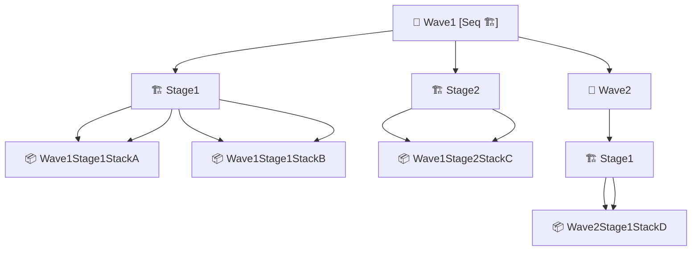

```mermaid
graph TB
    Wave0["🌊 Wave1 [Seq 🏗]"]
    Wave0Stage0["🏗 Stage1"]
    Wave0 --> Wave0Stage0
    StackWave1_Stage1_Wave1Stage1StackA["📦 Wave1Stage1StackA"]
    Wave0Stage0 --> StackWave1_Stage1_Wave1Stage1StackA
    StackWave1_Stage1_Wave1Stage1StackB["📦 Wave1Stage1StackB"]
    Wave0Stage0 --> StackWave1_Stage1_Wave1Stage1StackB
    StackWave1_Stage1_Wave1Stage1StackA["📦 Wave1Stage1StackA"]
    Wave0Stage0 --> StackWave1_Stage1_Wave1Stage1StackA
    StackWave1_Stage1_Wave1Stage1StackB["📦 Wave1Stage1StackB"]
    Wave0Stage0 --> StackWave1_Stage1_Wave1Stage1StackB
    Wave0Stage1["🏗 Stage2"]
    Wave0 --> Wave0Stage1
    StackWave1_Stage2_Wave1Stage2StackC["📦 Wave1Stage2StackC"]
    Wave0Stage1 --> StackWave1_Stage2_Wave1Stage2StackC
    StackWave1_Stage2_Wave1Stage2StackC["📦 Wave1Stage2StackC"]
    Wave0Stage1 --> StackWave1_Stage2_Wave1Stage2StackC
    Wave1["🌊 Wave2"]
    Wave1Stage0["🏗 Stage1"]
    Wave1 --> Wave1Stage0
    StackWave2_Stage1_Wave2Stage1StackD["📦 Wave2Stage1StackD"]
    Wave1Stage0 --> StackWave2_Stage1_Wave2Stage1StackD
    StackWave2_Stage1_Wave2Stage1StackD["📦 Wave2Stage1StackD"]
    Wave1Stage0 --> StackWave2_Stage1_Wave2Stage1StackD
    Wave0 --> Wave1
```
