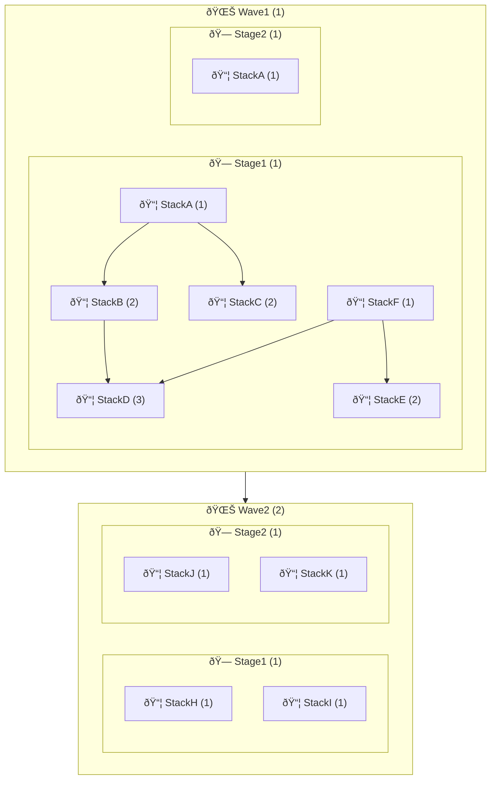

```mermaid
graph TD
    subgraph Wave0["🌊 Wave1 (1)"]
        subgraph Wave0Stage0["🗠Stage1 (1)"]
            StackWave1_Stage1_StackA["📦 StackA (1)"]
            StackWave1_Stage1_StackB["📦 StackB (2)"]
            StackWave1_Stage1_StackC["📦 StackC (2)"]
            StackWave1_Stage1_StackD["📦 StackD (3)"]
            StackWave1_Stage1_StackE["📦 StackE (2)"]
            StackWave1_Stage1_StackF["📦 StackF (1)"]
        end
        subgraph Wave0Stage1["🗠Stage2 (1)"]
            StackWave1_Stage2_StackA["📦 StackA (1)"]
        end
    end
    StackWave1_Stage1_StackA --> StackWave1_Stage1_StackB
    StackWave1_Stage1_StackA --> StackWave1_Stage1_StackC
    StackWave1_Stage1_StackB --> StackWave1_Stage1_StackD
    StackWave1_Stage1_StackF --> StackWave1_Stage1_StackD
    StackWave1_Stage1_StackF --> StackWave1_Stage1_StackE
    subgraph Wave1["🌊 Wave2 (2)"]
        subgraph Wave1Stage0["🗠Stage1 (1)"]
            StackWave2_Stage1_StackH["📦 StackH (1)"]
            StackWave2_Stage1_StackI["📦 StackI (1)"]
        end
        subgraph Wave1Stage1["🗠Stage2 (1)"]
            StackWave2_Stage2_StackJ["📦 StackJ (1)"]
            StackWave2_Stage2_StackK["📦 StackK (1)"]
        end
    end
    Wave0 --> Wave1
```
