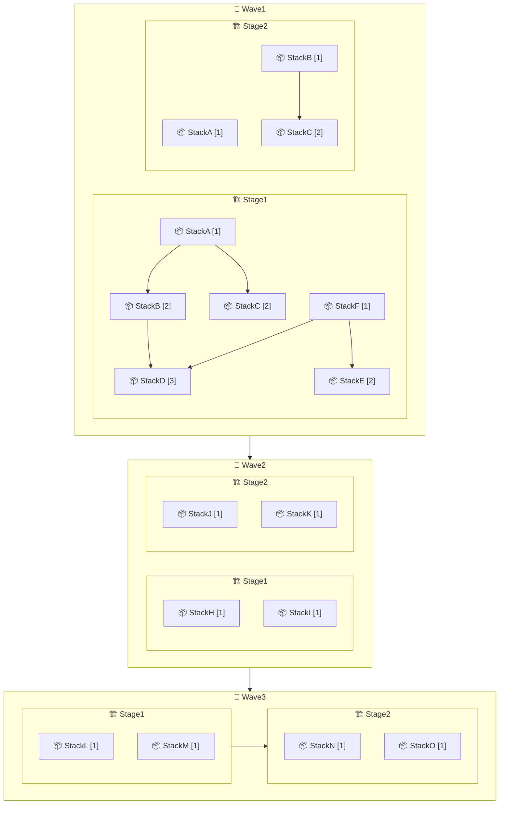

```mermaid
graph TD
    subgraph Wave0["🌊 Wave1"]
        subgraph Wave0Stage0["🏗 Stage1"]
            StackWave1_Stage1_StackA["📦 StackA [1]"]
            StackWave1_Stage1_StackB["📦 StackB [2]"]
            StackWave1_Stage1_StackC["📦 StackC [2]"]
            StackWave1_Stage1_StackD["📦 StackD [3]"]
            StackWave1_Stage1_StackE["📦 StackE [2]"]
            StackWave1_Stage1_StackF["📦 StackF [1]"]
        end
        subgraph Wave0Stage1["🏗 Stage2"]
            StackWave1_Stage2_StackA["📦 StackA [1]"]
            StackWave1_Stage2_StackB["📦 StackB [1]"]
            StackWave1_Stage2_StackC["📦 StackC [2]"]
        end
    end
    StackWave1_Stage1_StackA --> StackWave1_Stage1_StackB
    StackWave1_Stage1_StackA --> StackWave1_Stage1_StackC
    StackWave1_Stage1_StackB --> StackWave1_Stage1_StackD
    StackWave1_Stage1_StackF --> StackWave1_Stage1_StackD
    StackWave1_Stage1_StackF --> StackWave1_Stage1_StackE
    StackWave1_Stage2_StackB --> StackWave1_Stage2_StackC
    subgraph Wave1["🌊 Wave2"]
        subgraph Wave1Stage0["🏗 Stage1"]
            StackWave2_Stage1_StackH["📦 StackH [1]"]
            StackWave2_Stage1_StackI["📦 StackI [1]"]
        end
        subgraph Wave1Stage1["🏗 Stage2"]
            StackWave2_Stage2_StackJ["📦 StackJ [1]"]
            StackWave2_Stage2_StackK["📦 StackK [1]"]
        end
    end
    subgraph Wave2["🌊 Wave3"]
        subgraph Wave2Stage0["🏗 Stage1"]
            StackWave3_Stage1_StackL["📦 StackL [1]"]
            StackWave3_Stage1_StackM["📦 StackM [1]"]
        end
        subgraph Wave2Stage1["🏗 Stage2"]
            StackWave3_Stage2_StackN["📦 StackN [1]"]
            StackWave3_Stage2_StackO["📦 StackO [1]"]
        end
        Wave2Stage0 --> Wave2Stage1
    end
    Wave0 --> Wave1
    Wave1 --> Wave2
```
