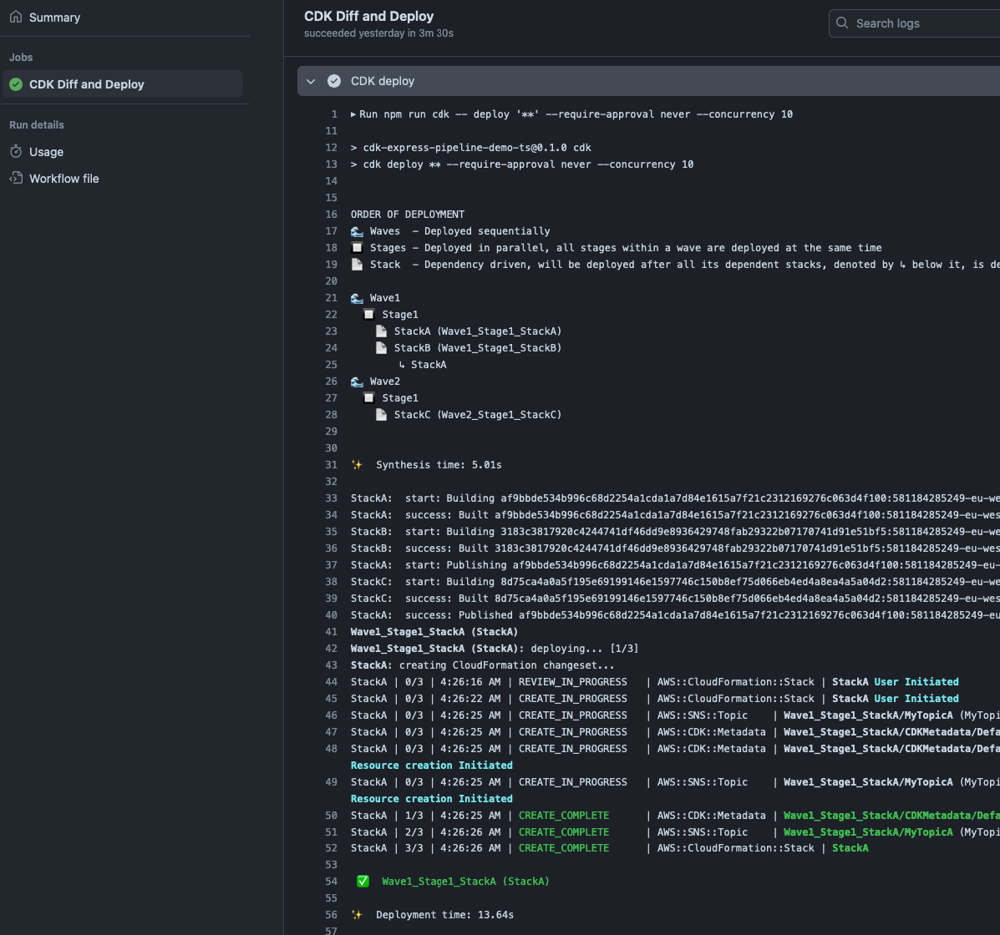

## GitHub Workflows

This section provides templates/examples of what a GitHub Actions workflow file could look like when using
CDK Express Pipeline. These examples are meant to be used as a starting point and can be customized to fit your
specific needs. 

:::note[Workflows can be generated automatically]
CDK Express Pipeline includes built-in generation that automatically creates GitHub Actions
workflows based on your pipeline configuration. See the [Generating GitHub Workflows](#generating-github-workflows) section below for more details.
:::

These examples all assume a project created with the default structure of the CDK CLI
command `cdk init app --language typescript`. These templates are taken from the demo TS project: https://github.com/rehanvdm/cdk-express-pipeline-demo-ts and 
can be found in the [.github/workflows-manual](https://github.com/rehanvdm/cdk-express-pipeline-demo-ts/tree/main/.github/workflows-manual) 
directory of that project.

<details open>
<summary>.github/workflows/diff.yml</summary>

Does a build and CDK Diff on PR open and push, the `cdk diff` output can be viewed in the action run logs.

```yaml
name: Diff
on:
  pull_request:
    types: [ opened, synchronize ]
  workflow_dispatch: { }

env:
  FORCE_COLOR: 1

jobs:
  deploy:
    name: CDK Diff and Deploy
    runs-on: ubuntu-latest
    permissions:
      actions: write
      contents: read
      id-token: write
    steps:
      - name: Checkout repo
        uses: actions/checkout@v4

      - name: Set up node
        uses: actions/setup-node@v3
        with:
          node-version: 20
          cache: npm

      - name: Install dependencies
        run: npm install ci

      # TODO: Alternatively use an AWS IAM user and set the credentials in GitHub Secrets (less secure than GH OIDC below)
      - name: Configure AWS credentials
        uses: aws-actions/configure-aws-credentials@v4
        with:
          role-to-assume: # TODO: Your role to assume
          aws-region: # TODO: your region

      - name: CDK diff
        run: npm run cdk -- diff '**'
```

Produces the following output in the GitHub Action logs:


</details>

<details>
<summary>.github/workflows/deploy.yml</summary>

Does a build, CDK Diff and Deploy when a push happens on the `main` branch.

```yaml
name: Deploy
on:
  push:
    branches:
      - main

env:
  FORCE_COLOR: 1

jobs:
  deploy:
    name: CDK Diff and Deploy
    runs-on: ubuntu-latest
    permissions:
      actions: write
      contents: read
      id-token: write
    steps:
      - name: Checkout repo
        uses: actions/checkout@v4

      - name: Set up node
        uses: actions/setup-node@v3
        with:
          node-version: 20
          cache: npm

      - name: Install dependencies
        run: npm install ci

      # TODO: Alternatively use an AWS IAM user and set the credentials in GitHub Secrets (less secure than GH OIDC below)
      - name: Configure AWS credentials
        uses: aws-actions/configure-aws-credentials@v4
        with:
          role-to-assume: # TODO: Your role to assume
          aws-region: # TODO: your region

      - name: CDK diff
        run: npm run cdk -- diff '**'

      - name: CDK deploy
        run: npm run cdk -- deploy '**' --require-approval never --concurrency 10
```

Produces the following output in the GitHub Action logs:


</details>

<details>
<summary>.github/workflows/deploy-advance.yml</summary>

The `synth` job builds the CDK app and saves the cloud assembly to the `./cloud_assembly_output` directory. The whole
repo with installed NPM packages and the cloud assembly is then cached. This job of the pipeline does not have access
to any AWS Secrets, the installing of packages and building is decoupled from the deployment improving security.

The `wave1` and `wave2` jobs fetches the cloud assembly from the cache and then does a CDK Diff and Deploy on only their
stacks. The `wave1` job targets all the stacks that start with `Wave1_` and the `wave2` job targets all the stacks that
start with `Wave2_`. It is important to add the `--exclusively` flag to only focus on the specified stacks and not its
dependencies.

```yaml
name: Deploy Advance
on:
  push:
    branches:
      - main
  workflow_dispatch: { } # While testing only

env:
  FORCE_COLOR: 1

jobs:
  synth:
    name: Build and CDK Synth
    runs-on: ubuntu-latest
    permissions:
      actions: write

      contents: read
      id-token: write
    steps:
      - name: Checkout repo
        uses: actions/checkout@v4

      - name: Set up node
        uses: actions/setup-node@v3
        with:
          node-version: 20
          cache: npm

      - name: Install dependencies
        run: npm install ci

      - name: CDK Synth
        run: npm run cdk -- synth --output ./cloud_assembly_output

      - name: Cache CDK Assets
        uses: actions/cache/save@v4
        with:
          path: ./
          key: "cdk-assets-${{ github.sha }}"

  wave1:
    name: Wave 1
    needs:
      - synth
    runs-on: ubuntu-latest
    permissions:
      actions: write
      contents: read
      id-token: write
    steps:
      - name: Fetch CDK Assets
        uses: actions/cache/restore@v4
        with:
          path: ./
          key: "cdk-assets-${{ github.sha }}"

      - name: Configure AWS credentials
        uses: aws-actions/configure-aws-credentials@v4
        with:
          role-to-assume: arn:aws:iam::581184285249:role/githuboidc-git-hub-deploy-role
          aws-region: eu-west-1

      - name: CDK diff
        run: npm run cdk -- diff 'Wave1_*' --exclusively --app ./cloud_assembly_output

      - name: CDK deploy
        run: npm run cdk -- deploy 'Wave1_*' --require-approval never --concurrency 10 --exclusively --app ./cloud_assembly_output

  # Manual approval

  wave2:
    name: Wave 2
    needs:
      - wave1
    runs-on: ubuntu-latest
    permissions:
      actions: write
      contents: read
      id-token: write
    steps:
      - name: Fetch CDK Assets
        uses: actions/cache/restore@v4
        with:
          path: ./
          key: "cdk-assets-${{ github.sha }}"

      # TODO: Alternatively use an AWS IAM user and set the credentials in GitHub Secrets (less secure than GH OIDC below)
      - name: Configure AWS credentials
        uses: aws-actions/configure-aws-credentials@v4
        with:
          role-to-assume: # TODO: Your role to assume
          aws-region: # TODO: your region

      - name: CDK diff
        run: npm run cdk -- diff 'Wave2_*' --exclusively --app ./cloud_assembly_output

      - name: CDK deploy
        run: npm run cdk -- deploy 'Wave2_*' --require-approval never --concurrency 10 --exclusively --app ./cloud_assembly_output
```

Produces the following output in the GitHub Action logs:


</details>

## Generating GitHub Workflows 

CDK Express Pipeline includes built-in GitHub CI workflow generation that automatically create GitHub
Actions workflows based on your pipeline configuration. This feature eliminates the need to manually write and maintain
GitHub workflow files.

### Basic Usage

To generate GitHub workflows, you need to specify a `GitHubWorkflowConfig` object when calling the
`generateGitHubWorkflows` method on your `CdkExpressPipeline` instance. This configuration defines how the workflows
should be structured, including build, synth, diff, and deploy commands.

This basic example assumes that you only have one environment/AWS account named `prod`. A CDK diff will be created on pull request
to the `main` branch, and a CDK deploy will be created on push action to the `main` branch. You can customize the
configuration to suit your needs, including multiple environments, custom build processes, and more.

```typescript
import { CdkExpressPipeline, GitHubWorkflowConfig } from 'cdk-express-pipeline';

// Define your pipeline (as shown in Usage section)
const app = new App();
const pipeline = new CdkExpressPipeline();
// ... add waves, stages, and stacks ...

// Define GitHub workflow configuration
const ghConfig: GitHubWorkflowConfig = {
  buildConfig: {
    type: 'preset-npm', // or 'workflow' to specify a GitHub workflow file for custom build process
  },
  diff: [{
    on: {
      pullRequest: {
        branches: ['main'],
      },
    },
    stackSelector: 'stage',
    assumeRoleArn: 'arn:aws:iam::123456789012:role/github-oidc-role',
    assumeRegion: 'us-east-1',
    commands: {
      prod: {
        synth: "npm run cdk -- synth '**'",
        diff: 'npm run cdk -- diff {stackSelector}',
      },
    },
  }],
  deploy: [{
    on: {
      push: {
        branches: ['main'],
      },
    },
    stackSelector: 'stage',
    assumeRoleArn: 'arn:aws:iam::123456789012:role/github-oidc-role',
    assumeRegion: 'us-east-1',
    commands: {
      prod: {
        synth: "npm run cdk -- synth '**'",
        deploy: 'npm run cdk -- deploy {stackSelector} --concurrency 10 --require-approval never --exclusively',
      },
    },
  }],
};

// Generate workflows and save them (by specifying the `true` argument) 
await pipeline.generateGitHubWorkflows(ghConfig, true);
```

The workflow generation creates the following files in your `.github` directory:

```
.github/
├── actions/
│   ├── cdk-express-pipeline-synth/
│   │   └── action.yml
│   ├── cdk-express-pipeline-diff/
│   │   └── action.yml
│   └── cdk-express-pipeline-deploy/
│       └── action.yml
└── workflows/
    ├── cdk-express-pipeline-diff.yml
    └── cdk-express-pipeline-deploy-prod.yml
```

### Configuration Options

#### Build Configuration

The `buildConfig` configuration defines how your CDK application is built before it is synthesized:

```typescript
buildConfig: {
  type: 'preset-npm', // Built-in npm build process
    // OR
  type: 'workflow',
  workflow: {
    path: '.github/actions/build', // Path to custom workflow
  },
},
```

Specify a built-in preset (like `preset-npm`) which uses the standard NPM build process GitHub
Action steps, installing node and then doing npm install. Alternatively, you can specify a **reusable action** that defines a
custom workflow in native GitHub Actions format, allowing for a more complex build processes. Like building
assets in parallel, pushing to container registries etc. For example:

```yaml
# .github/actions/build/action.yml
name: Custom Build
description: Only needed if Synth build step is set to 'workflow'. When able, use the `preset-` instead
runs:
  using: composite
  steps:
    - name: Set up node
      uses: actions/setup-node@v4
      with:
        node-version: 20
        cache: npm
    - name: Install dependencies
      run: npm ci
      shell: bash
    
    # Additional steps to build Applications that are referenced in the CDK app
```

#### Diff Configuration

The `diff` configuration defines when and how CDK diff operations are performed:

```typescript
diff: [{
  on: {
    pullRequest: {
      branches: ['main', 'develop'],
    },
    // OR
    push: {
      branches: ['main'],
    },
  },
  stackSelector: 'stage', // 'wave', 'stage', or 'stack'
  assumeRoleArn: 'arn:aws:iam::123456789012:role/github-oidc-role',
  assumeRegion: 'us-east-1',
  commands: [
    { prod: 'npm run cdk -- diff {stackSelector}' },
  ],
}]
```

The `on` field specifies the events that trigger the diff operation, you would most likely always want to trigger this
on pull requests.

The CDK diff will be written to the PR description, this is useful for reviewing changes before merging.
More info can be found in the [rehanvdm/cdk-express-pipeline-github-diff](https://github.com/rehanvdm/cdk-express-pipeline-github-diff)
GitHub action.


See the [Stack Selectors](#stack-selectors) section below for details on the `stackSelector` option. The `assumeRoleArn`
and `assumeRegion` options are used to configure the [AWS OIDC authentication](https://docs.github.com/en/actions/how-tos/security-for-github-actions/security-hardening-your-deployments/configuring-openid-connect-in-amazon-web-services)
for the GitHub Actions workflow, allowing it to assume a role in your AWS account securely when doing `commands`.

:::caution[IMPORTANT]
The `commands.diff` property must include the {stackSelector} string that gets replaced dynamically.
:::

The `commands` object defines the commands to run for synthesizing and then diffing your CDK application. Specifying
both `synth` and `diff` allows you to generate multiple CDK cloud assemblies for different environments 
(e.g., dev, prod) by using environment-specific commands.

This example assumes this is done with an `env` [CDK context variable](https://docs.aws.amazon.com/cdk/v2/guide/context.html#context-cli).
It shows how to generate two different cloud assemblies for `dev` and `prod` environments and store there output in
separate directories within the `cdk.out` directory.See [Multiple Environments](#multiple-environments) section
below for an example of this.

#### Deploy Configuration

The `deploy` configuration defines when and how CDK deploy operations are performed:

```typescript
deploy: [{
  on: {
    pullRequest: {
      branches: ['main'],
    },
  },
  stackSelector: 'stack', // 'wave', 'stage', or 'stack'
  assumeRoleArn: 'arn:aws:iam::123456789012:role/github-oidc-role',
  assumeRegion: 'us-east-1',
  commands: {
    prod: {
      synth: "npm run cdk -- synth '**'",
      deploy: 'npm run cdk -- deploy {stackSelector} --concurrency 10 --require-approval never --exclusively',
    },
  },
}]
```

The `on` field specifies the events that trigger the deploy operation, you would most likely always want to trigger this
on pushes or on tag creation.

See the [Stack Selectors](#stack-selectors) section below for details on the `stackSelector` option. The `assumeRoleArn`
and `assumeRegion` options are used to configure the [AWS OIDC authentication](https://docs.github.com/en/actions/how-tos/security-for-github-actions/security-hardening-your-deployments/configuring-openid-connect-in-amazon-web-services)
for the GitHub Actions workflow, allowing it to assume a role in your AWS account securely when doing the `commands`.

:::caution[IMPORTANT]
The `commands.deploy` property must include the {stackSelector} string that gets replaced dynamically.
:::

The `commands` object defines the commands to run for synthesizing and then deploying your CDK application. Specifying
both `synth` and `deploy` allows you to generate multiple CDK cloud assemblies for different environments
(e.g., dev, prod) by using environment-specific commands. See [Multiple Environments](#multiple-environments) section 
below for an example of this.

### Stack Selectors

The `stackSelector` option determines how stacks are targeted in diff and deploy operations:

- **`'wave'`**: Will create a GitHun Job in the Workflow for each wave (e.g., `Wave1_*`)
- **`'stage'`**: Will create a GitHun Job in the Workflow for each wave and stage combination (e.g., `Wave1_Stage1_*`)
- **`'stack'`**: Will create a GitHun Job in the Workflow for each wave, stage and stack combination (e.g., `Wave1_Stage1_Stack1`)

The `{stackSelector}` placeholder in commands is automatically replaced with the appropriate pattern as shown above.

Using `stack` is the most granular, but it will spawn a separate job for each stack, which may not be ideal for larger
pipelines as this adds a bit of overhead. Each job needs to fetch the `cdk.out` (cloud assembly) and `node_modules` from the
cache, which can add additional time, and thus cost. This might become an issue in pipelines with large assets 
and many stacks.

Recommended defaults:
- `diff` config: `'stage'` is a good balance between granularity and performance.
- `deploy` config: `'stack'` is recommended so that each job only shows the CFN deployment logs for that stack and the
  job can be retried if it fails without affecting other stacks.

### Advanced Features

#### Multiple Environments

Both `diff` and `deploy` configurations accept arrays. This allows you to define multiple workflows for different
environments or deployment strategies.

This example:
- Assumes that the `main` branch is linked to the `development` AWS environment/account and the `prod` branch is linked
  to the `production` environment.
- Does both `staging` and `production` diffs on PRs to the `main` branch. So that we can also see the changes that will
  be deployed to production when making this PR to staging.
- Does a `production` diff on PRs to the `production` branch.
- Defines separate deploy workflows for `development` and `production` when pushing to the `main` and `production`
  branches, respectively.

```typescript
const ghConfig: GitHubWorkflowConfig = {
 buildConfig: {
   type: 'preset-npm',
 },
 diff: [
   {
     id: 'development',
     on: {
       pullRequest: {
         branches: ['main'],
       },
     },
     stackSelector: 'stage',
     assumeRoleArn: 'arn:aws:iam::123456789012:role/github-oidc-role',
     assumeRegion: 'us-east-1',
     commands: {
       development: {
         synth: "npm run cdk -- synth '**' -c env=development --output=cdk.out/development",
         diff: 'npm run cdk -- diff {stackSelector} --app=cdk.out/development',
       },
       production: {
         synth: "npm run cdk -- synth '**' -c env=production --output=cdk.out/production",
         diff: 'npm run cdk -- diff {stackSelector} --app=cdk.out/production',
       },
     },
   },
   {
     id: 'production',
     on: {
       pullRequest: {
         branches: ['production'],
       },
     },
     stackSelector: 'stage',
     assumeRoleArn: 'arn:aws:iam::123456789012:role/github-oidc-role',
     assumeRegion: 'us-east-1',
     commands: {
       production: {
         synth: "npm run cdk -- synth '**' -c env=production --output=cdk.out/production",
         diff: 'npm run cdk -- diff {stackSelector} --app=cdk.out/production',
       },
     },
   },
 ],
 deploy: [
   {
     id: 'development',
     on: {
       push: {
         branches: ['main'],
       },
     },
     stackSelector: 'stack',
     assumeRoleArn: 'arn:aws:iam::123456789012:role/github-oidc-role',
     assumeRegion: 'us-east-1',
     commands: {
       development: {
         synth: "npm run cdk -- synth '**' -c env=development --output=cdk.out/development",
         deploy: 'npm run cdk -- deploy {stackSelector} --app=cdk.out/development --concurrency 10 --require-approval never --exclusively',
       },
     },
   },
   {
     id: 'production',
     on: {
       push: {
         branches: ['production'],
       },
     },
     stackSelector: 'stack',
     assumeRoleArn: 'arn:aws:iam::123456789012:role/github-oidc-role',
     assumeRegion: 'us-east-1',
     commands: {
       production: {
         synth: "npm run cdk -- synth '**' -c env=production --output=cdk.out/production",
         deploy: 'npm run cdk -- deploy {stackSelector} --app=cdk.out/production --concurrency 10 --require-approval never --exclusively',
       },
     },
   },
 ],
}
```

The `ids` for the `diff` and `deploy` objects are used to generate unique workflow file names in the
`.github/workflows` directory. For example, these files will be generated (along with the reusable actions in the
`.github/actions` directory):

```
.github/
├── actions/
│   ├── cdk-express-pipeline-synth/
│   │   └── action.yml
│   ├── cdk-express-pipeline-diff/
│   │   └── action.yml
│   └── cdk-express-pipeline-deploy/
│       └── action.yml
└── workflows/
    ├── cdk-express-pipeline-diff-development.yml
    ├── cdk-express-pipeline-diff-production.yml
    ├── cdk-express-pipeline-deploy-development.yml
    └── cdk-express-pipeline-deploy-production.yml
```

#### Customization (Escape hatches)

The generated workflows can be customized using JSON Patch operations:

```typescript
import { CdkExpressPipeline, GitHubWorkflowConfig } from 'cdk-express-pipeline';

// Define your pipeline (as shown in Usage section)
const app = new App();
const pipeline = new CdkExpressPipeline();
// ... add waves, stages, and stacks ...

// Define GitHub workflow configuration
const ghConfig: GitHubWorkflowConfig = {
  ...
};

const ghWorkflows = await pipeline.generateGitHubWorkflows(ghConfig, false);
for (let w = 0; w < ghWorkflows.length; w++) {
  if (ghWorkflows[w].fileName === 'workflows/cdk-express-pipeline-deploy-dev.yml') {
    ghWorkflows[w]?.content.patch(
      // Change the concurrency of the deploy dev workflow
      JsonPatch.replace('/concurrency/cancel-in-progress', true),
      //Add an extra step to the build job that echos success
      JsonPatch.add('/jobs/build/steps/-', {
        name: 'Echo Success',
        shell: 'bash',
        run: 'echo "Build succeeded!"',
      }),
    );
  }
}

pipeline.saveGitHubWorkflows(ghWorkflows);
```

The JSON object of the workflow can be modified using the `JsonPatch` class, which provides the following methods:
- `add(path, value)`: Adds a value to an object or inserts it into an array. In the case of an
  array, the value is inserted before the given index. The `-` character can be
  used instead of an index to insert at the end of an array.
  Ex: `JsonPatch.add('/milk', true) JsonPatch.add('/biscuits/1', { "name": "Ginger Nut" })`
- `remove(path)`: Removes a value from an object or array.
  Ex: `JsonPatch.remove('/biscuits') JsonPatch.remove('/biscuits/0')`
- `replace(path, value)`: Replaces a value. Equivalent to a “remove” followed by an “add”.
  Ex: `JsonPatch.replace('/biscuits/0/name', 'Chocolate Digestive')`
- `copy(from, path)`: Copies a value from one location to another within the JSON document. Both
  from and path are JSON Pointers.
  Ex: `JsonPatch.copy('/biscuits/0', '/best_biscuit')`
- `move(from, path)`: Moves a value from one location to the other. Both from and path are JSON Pointers.
  Ex: `JsonPatch.move('/biscuits', '/cookies')`
- `test(path, value)`: Tests that the specified value is set in the document. If the test fails,
  then the patch as a whole should not apply.
  Ex: `JsonPatch.test('/best_biscuit/name', 'Choco Leibniz')`