```mermaid
graph TD
    subgraph Wave0["🌊 Wave1"]
        subgraph Wave0Stage0["🏗 Stage1"]
            StackWave1_Stage1_StackA["📦 StackA [1]"]
            StackWave1_Stage1_StackB["📦 StackB [2]"]
            StackWave1_Stage1_StackC["📦 StackC [2]"]
            StackWave1_Stage1_StackD["📦 StackD [3]"]
            StackWave1_Stage1_StackE["📦 StackE [2]"]
            StackWave1_Stage1_StackF["📦 StackF [1]"]
        end
        subgraph Wave0Stage1["🏗 Stage2"]
            StackWave1_Stage2_StackA["📦 StackA [1]"]
            StackWave1_Stage2_StackB["📦 StackB [1]"]
            StackWave1_Stage2_StackC["📦 StackC [2]"]
        end
    end
    StackWave1_Stage1_StackA --> StackWave1_Stage1_StackB
    StackWave1_Stage1_StackA --> StackWave1_Stage1_StackC
    StackWave1_Stage1_StackB --> StackWave1_Stage1_StackD
    StackWave1_Stage1_StackF --> StackWave1_Stage1_StackD
    StackWave1_Stage1_StackF --> StackWave1_Stage1_StackE
    StackWave1_Stage2_StackB --> StackWave1_Stage2_StackC
    subgraph Wave1["🌊 Wave2"]
        subgraph Wave1Stage0["🏗 Stage1"]
            StackWave2_Stage1_StackH["📦 StackH [1]"]
            StackWave2_Stage1_StackI["📦 StackI [1]"]
        end
        subgraph Wave1Stage1["🏗 Stage2"]
            StackWave2_Stage2_StackJ["📦 StackJ [1]"]
            StackWave2_Stage2_StackK["📦 StackK [1]"]
        end
    end
    subgraph Wave2["🌊 Wave3"]
        subgraph Wave2Stage0["🏗 Stage1"]
            StackWave3_Stage1_StackL["📦 StackL [1]"]
            StackWave3_Stage1_StackM["📦 StackM [1]"]
        end
        subgraph Wave2Stage1["🏗 Stage2"]
            StackWave3_Stage2_StackN["📦 StackN [1]"]
            StackWave3_Stage2_StackO["📦 StackO [1]"]
        end
        Wave2Stage0 --> Wave2Stage1
    end
    Wave0 --> Wave1
    Wave1 --> Wave2
```

CDK Express Pipeline determines deployment order based on a hierarchical structure of Waves, Stages, and Stacks.
Understanding this order is crucial for designing efficient pipelines and troubleshooting deployment issues.

## Deployment Order Rules

The Wave, Stage and Stack order follows these rules:

- **Waves** are deployed sequentially, one after the other
- **Stages** within a Wave are deployed in parallel by default, unless configured to be sequential
- **Stacks** within a Stage are deployed in order of stack dependencies within a Stage

When used with `cdk deploy '**' --concurrency 10`, it will deploy all stacks in parallel, 10 at a time, 
where possible while still adhering to the dependency graph.

## Visual Example

For example, the following definition of Waves, Stages and Stacks:


Will create a dependency graph as follows:


<br>

<details>
<summary>✨✨✨ DEPLOYMENT ORDER VISUALIZED STEP-BY-STEP ✨✨✨</summary>


</details>


## Outputs 

### CLI Console message

The CLI Console message is enabled by default when running `pipeline.synth`. This can be disabled by passing `false` to the
`print` argument in the `synth` function:

```typescript
expressPipeline.synth([wave1, wave2], false);
```

Let's use an example of a pipeline that features all possible display options:

<details>
<summary>Verbal explanation of the output</summary>

There are three waves. Waves run sequentially. Within each wave, stages run in parallel unless marked `[Seq 🏗]`, 
which only Wave3 is. Stacks in a stage deploy in the order based on their dependencies, shown with arrows (`↳`), 
and their position in the deployment order is indicated with square brackets like `[1]`.

Wave1 has two stages. In Stage1, StackA and StackF (shown by `[1]`) deploy first. StackB, StackC, and
StackE (`[2]`) follow, all depending on earlier stacks. StackD (`[3]`) is last, depending on StackB and StackF.
Stage2 runs in parallel and deploys StackA and StackB (`[1]`) first, followed by StackC (`[2]`), which depends 
on StackB.

Wave2 has two stages, all stacks (`[1]`) in both stages deploy at the same time since they have no dependencies.

Wave3 is marked `[Seq 🏗]`, so its stages run one after another. Stage1 deploys StackL and StackM (`[1]`) at 
the same time, and then Stage3 deploys StackN and StackO (`[1]`).

The stack selector (ID) is shown in parentheses next to each stack. For example, Wave1 Stage1 StackA has the 
selector `Wave1_Stage1_StackA`. Since every line begins with a pipe (`|`), we can infer that the command used
was `cdk (diff|deploy) '**'`, meaning all stacks are targeted with this command. We could instead have targeted 
a specific wave, stage or stack by using a command like `cdk (diff|deploy) 'Wave1_Stage1_*'`, which would only 
deploy the stacks in Wave1 Stage1.
</details>

```plaintext
ORDER OF DEPLOYMENT
🌊 Waves  - Deployed sequentially.
🏗 Stages - Deployed in parallel by default, unless the wave is marked `[Seq 🏗]` for sequential stage execution.
📦 Stacks - Deployed after their dependent stacks within the stage (dependencies shown below them with ↳).
           - Lines prefixed with a pipe (|) indicate stacks matching the CDK pattern.
           - Stack deployment order within the stage is shown in square brackets (ex: [1])

| 🌊 Wave1
|   🏗 Stage1
|     📦 StackA (Wave1_Stage1_StackA) [1]
|     📦 StackB (Wave1_Stage1_StackB) [2]
|        ↳ StackA
|     📦 StackC (Wave1_Stage1_StackC) [2]
|        ↳ StackA
|     📦 StackD (Wave1_Stage1_StackD) [3]
|        ↳ StackB, StackF
|     📦 StackE (Wave1_Stage1_StackE) [2]
|        ↳ StackF
|     📦 StackF (Wave1_Stage1_StackF) [1]
|   🏗 Stage2
|     📦 StackA (Wave1_Stage2_StackA) [1]
|     📦 StackB (Wave1_Stage2_StackB) [1]
|     📦 StackC (Wave1_Stage2_StackC) [2]
|        ↳ StackB
| 🌊 Wave2
|   🏗 Stage1
|     📦 StackH (Wave2_Stage1_StackH) [1]
|     📦 StackI (Wave2_Stage1_StackI) [1]
|   🏗 Stage2
|     📦 StackJ (Wave2_Stage2_StackJ) [1]
|     📦 StackK (Wave2_Stage2_StackK) [1]
| 🌊 Wave3 [Seq 🏗]
|   🏗 Stage1
|     📦 StackL (Wave3_Stage1_StackL) [1]
|     📦 StackM (Wave3_Stage1_StackM) [1]
|   🏗 Stage2
|     📦 StackN (Wave3_Stage2_StackN) [1]
|     📦 StackO (Wave3_Stage2_StackO) [1]
```

### Mermaid Diagram

The Deployment Order can also be outputted to a markdown file containing a Mermaid graph. This option is
**disabled** by default, and can be enabled when running the `pipeline.synth`. The output defaults to the root of 
the project with the filename `pipeline-deployment-order.md`, but this can be changed in the function arguments.

```typescript
expressPipeline.synth(
  [wave1, wave2],
  true, // CLI Console output enabled,
  { } // Enable Mermaid output with default path
);
```

<details>
<summary>Verbal explanation of the Mermaid output</summary>

There are three waves. Waves run sequentially. Within each wave, stages run in parallel unless indicated by an
arrow, which only Wave3's stages are. Stacks in a stage deploy in the order based on their dependencies, shown 
with arrows, and their position in the deployment order is indicated with square brackets like `[1]`.

Wave1 has two stages. In Stage1, StackA and StackF (shown by `[1]`) deploy first. StackB, StackC, and StackE 
(`[2]`) follow, all depending on earlier stacks. StackD (`[3]`) is last, depending on StackB and StackF. Stage2 
runs in parallel and deploys StackA and StackB (`[1]`) first, followed by StackC (`[2]`), which depends on StackB.

Wave2 has two stages, all stacks (`[1]`) in both stages deploy at the same time since they have no dependencies.

Wave3 is marked `[Seq 🏗]`, so its stages run one after another. Stage1 deploys StackL and StackM (`[1]`) at the
same time, and then Stage3 deploys StackN and StackO (`[1]`).

The stack selector is shown in parentheses next to each stack. For example, Wave1 Stage1 StackA has the selector
`Wave1_Stage1_StackA`. Since every line begins with a pipe (`|`), we can infer that the command used was
`cdk (diff|deploy) '**'`, meaning all stacks are targeted with this command. We could instead have targeted a
specific wave, stage or stack by using a command like `cdk (diff|deploy) 'Wave1_Stage1_*'`, which would only 
deploy the stacks in Wave1 Stage1.
</details>

