[CDK Express Pipeline](https://github.com/rehanvdm/cdk-express-pipeline/tree/main) is a library built on the AWS CDK,
allowing you to define pipelines in a CDK-native method. It leverages the CDK CLI to compute and deploy the correct
dependency graph between Waves, Stages, and Stacks using the <code>.addDependency</code> method, making it build-system
agnostic and an alternative to AWS CDK Pipelines.

## Key Features

- **Build System Agnostic**: Works on any system for example your local machine, GitHub, GitLab, etc.
- **Waves and Stages**: Define your pipeline structure using Waves and Stages
- **Uses CDK CLI**: Uses the `cdk deploy` command to deploy your stacks
- **Multi Account and Multi Region**: Supports deployments across multiple accounts and regions mad possible by `cdk bootstrap`
- **Fast Deployments**: Make use of concurrent/parallel Stack deployments
- **Multi-Language Support**: Supports **TS and Python** CDK
- **Generated Mermaid Diagrams**: Generates diagrams for your pipeline structure
- **Generated CI Workflows**: Generates CI workflows for your pipeline (only GitHub Actions supported for now, others welcome)

## Quick Start

:::note[Tutorial]
See the [Getting Started](/cdk-express-pipeline/tutorials/getting-started/) tutorial for a step-by-step guide on how 
to set up and use CDK Express Pipeline.
:::

```bash
npm install cdk-express-pipeline
```

Let's illustrate a common patten, deploying infra stacks before application stacks. The `IamStack` is only in the
`us-east-1` region, while the `NetworkingStack` is in both `us-east-1` and `eu-west-1`.

The application stacks `AppAStack` and `AppBStack` depend on the networking stack and are deployed in both regions.
The `AppBStack` also depends on the `AppAStack`.

```typescript
//bin/your-app.ts
const app = new App();
const expressPipeline = new CdkExpressPipeline();

const regions = ['us-east-1', 'eu-west-1'];

const infraWave = expressPipeline.addWave('Infra');
const infraWaveUsEast1Stage = infraWave.addStage('us-east-1');
const infraWaveEuWest1Stage = infraWave.addStage('eu-west-1');
new IamStack(app, 'Iam', infraWaveUsEast1Stage);
new NetworkingStack(app, 'Networking', infraWaveUsEast1Stage);
new NetworkingStack(app, 'Networking', infraWaveEuWest1Stage);

const appWave = expressPipeline.addWave('Application');
for (const region of regions) {
  const appWaveStage = appWave.addStage(region);
  const appA = new AppAStack(app, 'AppA', appWaveStage);
  const appB = new AppBStack(app, 'AppB', appWaveStage);
  appB.addExpressDependency(appA);
}

expressPipeline.synth([
  infraWave,
  appWave,
], true, {});
```

Running `cdk deploy '**' --concurrency 10` will deploy all stacks in the correct order based on their dependencies. This
is indicated on the CLI output:

```plaintext
ORDER OF DEPLOYMENT
🌊 Waves  - Deployed sequentially.
🏗 Stages - Deployed in parallel by default, unless the wave is marked `[Seq 🏗]` for sequential stage execution.
📦 Stacks - Deployed after their dependent stacks within the stage (dependencies shown below them with ↳).
           - Lines prefixed with a pipe (|) indicate stacks matching the CDK pattern.
           - Stack deployment order within the stage is shown in square brackets (ex: [1])

| 🌊 Infra
|   🏗 us-east-1
|     📦 Iam (Infra_us-east-1_Iam) [1]
|     📦 Networking (Infra_us-east-1_Networking) [1]
|   🏗 eu-west-1
|     📦 Networking (Infra_eu-west-1_Networking) [1]
| 🌊 Application
|   🏗 us-east-1
|     📦 AppA (Application_us-east-1_AppA) [1]
|     📦 AppB (Application_us-east-1_AppB) [2]
|        ↳ AppA
|   🏗 eu-west-1
|     📦 AppA (Application_eu-west-1_AppA) [1]
|     📦 AppB (Application_eu-west-1_AppB) [2]
|        ↳ AppA
```

A Mermaid diagram of the pipeline is saved to `./pipeline-deployment-order.md` automatically:

```mermaid
graph TD
    subgraph Wave0["🌊 Infra"]
        subgraph Wave0Stage0["🏗 us-east-1"]
            StackInfra_us_east_1_Iam["📦 Iam [1]"]
            StackInfra_us_east_1_Networking["📦 Networking [1]"]
        end
        subgraph Wave0Stage1["🏗 eu-west-1"]
            StackInfra_eu_west_1_Networking["📦 Networking [1]"]
        end
    end
    subgraph Wave1["🌊 Application"]
        subgraph Wave1Stage0["🏗 us-east-1"]
            StackApplication_us_east_1_AppA["📦 AppA [1]"]
            StackApplication_us_east_1_AppB["📦 AppB [2]"]
        end
        subgraph Wave1Stage1["🏗 eu-west-1"]
            StackApplication_eu_west_1_AppA["📦 AppA [1]"]
            StackApplication_eu_west_1_AppB["📦 AppB [2]"]
        end
    end
    StackApplication_us_east_1_AppA --> StackApplication_us_east_1_AppB
    StackApplication_eu_west_1_AppA --> StackApplication_eu_west_1_AppB
    Wave0 --> Wave1
```



CDK Express Pipeline is build system agnostic, meaning you can run the `cdk deploy` command from any environment,
such as your local machine, GitHub Actions, GitLab CI, etc. It includes a function to generate GitHub Actions workflow,
more build systems can be added as needed.

Continue reading the [Introduction guide](/cdk-express-pipeline/guides/introduction/) for more details on how to use CDK Express Pipeline.

## How does it work?

This library makes use of the fact that the CDK CLI computes the dependency graph of your stacks and deploys them in 
the correct order. It creates the correct dependency graph between Waves, Stages and Stacks with the help of the 
native `.addDependency` method of the CDK Stack. The `cdk deploy '**' --concurrency 10`  command will deploy all
stacks in the correct order, in parallel where possible, based on their dependencies.


## Waves, Stages, and Stacks

CDK Express Pipeline organizes your infrastructure into a hierarchical structure:

- **Waves**: Deployed sequentially, one after another
- **Stages**: Within a wave, deployed in parallel by default (can be configured for sequential)
- **Stacks**: Within a stage, deployed based on dependencies

This structure allows for:
- **Predictable deployment order** with clear dependencies
- **Parallel execution** where possible for faster deployments
- **Selective deployment** targeting specific waves, stages, or stacks
- **Consistent naming** for easy targeting and management

## Comparison with AWS CDK Pipelines

### Challenges with CDK Pipelines

CDK Pipelines has some limits that can make it less suitable for teams who want fast, flexible, and easy-to-maintain
CI/CD workflows:

- **Tightly linked to CodePipeline**: CDK Pipelines only works with AWS CodePipeline, which limits your CI/CD choices.
- **Complicated asset management**: It needs pre-asset generation steps and uses extra CodeBuild projects to build and
  push assets, increasing deployment time.
- **Slower deployments**: Self-mutation and the overhead of many CodeBuild steps slow down deployments, especially as you add more
  stacks, stages and waves.
- **Fixed structure**: Renaming stages or moving stacks can cause resources to be replaced because of how the CDK
  `Stage` construct works.
- **Extra setup for cross-account or cross-region**: CDK Pipelines needs extra stacks to manage deployments across
  accounts or regions.
- **Authentication needs secrets**: Connecting with GitHub or other CI/CD systems requires long-lived secrets stored in
  AWS Secrets Manager.

### Benefits of CDK Express Pipeline

CDK Express Pipeline solves these problems with a simpler and faster approach:

- **Works with any CI/CD system**: It runs locally and with any CI/CD tool, not just AWS CodePipeline.
- **Simple commands**: Deployments use a single `cdk deploy` command. There is no need for separate asset pre-generation.
- **Standard bootstrapping**: It uses the same CDK bootstrap process you already know. There are no extra stacks for
  cross-account setups.
- **Handles assets natively**: Assets are managed like in standard CDK projects. There are no custom CodeBuild steps.
- **Faster deployments**: Deployments can be up to 5 times faster for first & pipeline changing deployments and 2+ times
  faster on normal deploys. It will become even faster over time, as CDK Pipelines tends to grow more bloated and slower
  with each additional stack, stage and wave.
- **More flexible**: You can rename stages or move stacks without causing unwanted resource replacements.
- **Modern authentication**: It supports OIDC integration with modern CI/CD systems, so you do not need long-lived secrets in
  Secrets Manager.