import { LinkCard, CardGrid } from '@astrojs/starlight/components';


## What is CDK Express Pipeline?

[CDK Express Pipeline](https://github.com/rehanvdm/cdk-express-pipeline/tree/main) is a library built on the AWS CDK, 
allowing you to define pipelines in a CDK-native method. It leverages the CDK CLI to compute and deploy the correct 
dependency graph between Waves, Stages, and Stacks using the <code>.addDependency</code> method, making it build-system 
agnostic and an alternative to AWS CDK Pipelines.

<CardGrid>
  <LinkCard
    title="Introduction"
    href="/cdk-express-pipeline/guides/introduction/"
    description="Learn about CDK Express Pipeline and how it works"
  />
  <LinkCard
    title="Tutorial - Getting Started"
    href="/cdk-express-pipeline/tutorials/getting-started/"
    description="Learn how to get started with CDK Express Pipeline"
  />
  <LinkCard
    title="Deployment Order"
    href="/cdk-express-pipeline/guides/deployment-order/"
    description="Understand how CDK Express Pipeline determines the deployment order of Waves, Stages, and Stacks"
  />
  <LinkCard
    title="Migrate From CDK Pipelines"
    href="/cdk-express-pipeline/migrations/migrate-from-cdk-pipelines-to-cdk-express-pipeline/"
    description="Learn how to migrate from CDK Pipelines to CDK Express Pipeline"
  />
</CardGrid>

## Key Features

- **Build System Agnostic**: Works on any system for example your local machine, GitHub, GitLab, etc.
- **Waves and Stages**: Define your pipeline structure using Waves and Stages
- **Uses CDK CLI**: Uses the `cdk deploy` command to deploy your stacks
- **Multi Account and Multi Region**: Supports deployments across multiple accounts and regions mad possible by `cdk bootstrap`
- **Fast Deployments**: Make use of concurrent/parallel Stack deployments
- **Multi-Language Support**: Supports **TS and Python** CDK
- **Generated Mermaid Diagrams**: Generates diagrams for your pipeline structure
- **Generated CI Workflows**: Generates CI workflows for your pipeline (only GitHub Actions supported for now, others welcome)

## Quick Start

```bash
npm install cdk-express-pipeline
```

Let's illustrate a common patten, deploying infra stacks before application stacks. The `IamStack` is only in the
`us-east-1` region, while the `NetworkingStack` is in both `us-east-1` and `eu-west-1`.

The application stacks `AppAStack` and `AppBStack` depend on the networking stack and are deployed in both regions. 
The `AppBStack` also depends on the `AppAStack`.

```typescript
//bin/your-app.ts
const app = new App();
const expressPipeline = new CdkExpressPipeline();

const regions = ['us-east-1', 'eu-west-1'];

const infraWave = expressPipeline.addWave('Infra');
const infraWaveUsEast1Stage = infraWave.addStage('us-east-1');
const infraWaveEuWest1Stage = infraWave.addStage('eu-west-1');
new IamStack(app, 'Iam', infraWaveUsEast1Stage);
new NetworkingStack(app, 'Networking', infraWaveUsEast1Stage);
new NetworkingStack(app, 'Networking', infraWaveEuWest1Stage);

const appWave = expressPipeline.addWave('Application');
for (const region of regions) {
  const appWaveStage = appWave.addStage(region);
  const appA = new AppAStack(app, 'AppA', appWaveStage);
  const appB = new AppBStack(app, 'AppB', appWaveStage);
  appB.addExpressDependency(appA);
}

expressPipeline.synth([
  infraWave,
  appWave,
], true, {});
```

Running `cdk deploy '**' --concurrency 10` will deploy all stacks in the correct order based on their dependencies. This
is indicated on the CLI output:

```plaintext
ORDER OF DEPLOYMENT
🌊 Waves  - Deployed sequentially.
🏗 Stages - Deployed in parallel by default, unless the wave is marked `[Seq 🏗]` for sequential stage execution.
📦 Stacks - Deployed after their dependent stacks within the stage (dependencies shown below them with ↳).
           - Lines prefixed with a pipe (|) indicate stacks matching the CDK pattern.
           - Stack deployment order within the stage is shown in square brackets (ex: [1])

| 🌊 Infra
|   🏗 us-east-1
|     📦 Iam (Infra_us-east-1_Iam) [1]
|     📦 Networking (Infra_us-east-1_Networking) [1]
|   🏗 eu-west-1
|     📦 Networking (Infra_eu-west-1_Networking) [1]
| 🌊 Application
|   🏗 us-east-1
|     📦 AppA (Application_us-east-1_AppA) [1]
|     📦 AppB (Application_us-east-1_AppB) [2]
|        ↳ AppA
|   🏗 eu-west-1
|     📦 AppA (Application_eu-west-1_AppA) [1]
|     📦 AppB (Application_eu-west-1_AppB) [2]
|        ↳ AppA
```

A Mermaid diagram of the pipeline is saved to `./pipeline-deployment-order.md` automatically:

```mermaid
graph TD
    subgraph Wave0["🌊 Infra"]
        subgraph Wave0Stage0["🏗 us-east-1"]
            StackInfra_us_east_1_Iam["📦 Iam [1]"]
            StackInfra_us_east_1_Networking["📦 Networking [1]"]
        end
        subgraph Wave0Stage1["🏗 eu-west-1"]
            StackInfra_eu_west_1_Networking["📦 Networking [1]"]
        end
    end
    subgraph Wave1["🌊 Application"]
        subgraph Wave1Stage0["🏗 us-east-1"]
            StackApplication_us_east_1_AppA["📦 AppA [1]"]
            StackApplication_us_east_1_AppB["📦 AppB [2]"]
        end
        subgraph Wave1Stage1["🏗 eu-west-1"]
            StackApplication_eu_west_1_AppA["📦 AppA [1]"]
            StackApplication_eu_west_1_AppB["📦 AppB [2]"]
        end
    end
    StackApplication_us_east_1_AppA --> StackApplication_us_east_1_AppB
    StackApplication_eu_west_1_AppA --> StackApplication_eu_west_1_AppB
    Wave0 --> Wave1
```



CDK Express Pipeline is build system agnostic, meaning you can run the `cdk deploy` command from any environment, 
such as your local machine, GitHub Actions, GitLab CI, etc. It includes a function to generate GitHub Actions workflow,
more build systems can be added as needed. 

## Next Steps 

<CardGrid>
  <LinkCard
    title="Introduction"
    href="/cdk-express-pipeline/guides/introduction/"
    description="Learn about CDK Express Pipeline and how it works"
  />
  <LinkCard
    title="Tutorial - Getting Started"
    href="/cdk-express-pipeline/tutorials/getting-started/"
    description="Learn how to get started with CDK Express Pipeline"
  />
  <LinkCard
    title="Deployment Order"
    href="/cdk-express-pipeline/guides/deployment-order/"
    description="Understand how CDK Express Pipeline determines the deployment order of Waves, Stages, and Stacks"
  />
  <LinkCard
    title="Migrate From CDK Pipelines"
    href="/cdk-express-pipeline/migrations/migrate-from-cdk-pipelines-to-cdk-express-pipeline/"
    description="Learn how to migrate from CDK Pipelines to CDK Express Pipeline"
  />
</CardGrid>

