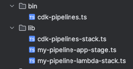

AWS [CDK Pipelines](https://docs.aws.amazon.com/cdk/api/v2/docs/aws-cdk-lib.pipelines-readme.html) is a
useful for deploying applications with AWS CodePipeline, but it is opinionated, can be
complicated, and may not suit every use case. [CDK Express Pipeline](https://github.com/rehanvdm/cdk-express-pipeline)
is another option that makes deployment simpler while keeping flexibility and good performance.

This guide shows how to move from CDK Pipelines to CDK Express Pipeline. It explains the reasons for switching, shares
benchmark results, and highlights key differences. You can find the source code for both examples in this GitHub
repository: [https://github.com/rehanvdm/cdk-pipelines-migrate-to-express/](https://github.com/rehanvdm/cdk-pipelines-migrate-to-express/)

## Why Migrate?

### Challenges with CDK Pipelines

CDK Pipelines has some limits that can make it less suitable for teams who want fast, flexible, and easy-to-maintain
CI/CD workflows:

- **Tightly linked to CodePipeline**: CDK Pipelines only works with AWS CodePipeline, which limits your CI/CD choices.
- **Complicated asset management**: It needs pre-asset generation steps and uses extra CodeBuild projects to build and
  push assets, increasing deployment time.
- **Slower deployments**: Self-mutation and the overhead of many CodeBuild steps slow down deployments, especially as you add more
  stacks, stages and waves.
- **Fixed structure**: Renaming stages or moving stacks can cause resources to be replaced because of how the CDK
  `Stage` construct works.
- **Extra setup for cross-account or cross-region**: CDK Pipelines needs extra stacks to manage deployments across
  accounts or regions.
- **Authentication needs secrets**: Connecting with GitHub or other CI/CD systems requires long-lived secrets stored in
  AWS Secrets Manager.

### Benefits of CDK Express Pipeline

CDK Express Pipeline solves these problems with a simpler and faster approach:

- **Works with any CI/CD system**: It runs locally and with any CI/CD tool, not just AWS CodePipeline.
- **Simple commands**: Deployments use a single `cdk deploy` command. There is no need for separate asset pre-generation.
- **Standard bootstrapping**: It uses the same CDK bootstrap process you already know. There are no extra stacks for
  cross-account setups.
- **Handles assets natively**: Assets are managed like in standard CDK projects. There are no custom CodeBuild steps.
- **Faster deployments**: Deployments can be up to 5 times faster for first & pipeline changing deployments and 2+ times
  faster on normal deploys. It will become even faster over time, as CDK Pipelines tends to grow more bloated and slower
  with each additional stack, stage and wave.
- **More flexible**: You can rename stages or move stacks without causing unwanted resource replacements.
- **Modern authentication**: It supports OIDC integration with modern CI/CD systems, so you do not need long-lived secrets in
  Secrets Manager.

## CDK Pipelines Setup

We use the [CDK Pipelines Getting Started Guide](https://docs.aws.amazon.com/cdk/v2/guide/cdk-pipeline.html) as a
reference for the CDK Pipelines setup. Then we show how to move this to CDK Express Pipeline. The goal is to deploy the
`MyLambdaStack` in two regions, `eu-west-1` and `us-east-1`.

We only highlight some code snippets and important steps. For the full code, see the repo at
[https://github.com/rehanvdm/cdk-pipelines-migrate-to-express/tree/main/cdk-pipelines](https://github.com/rehanvdm/cdk-pipelines-migrate-to-express/tree/main/cdk-pipelines)

Important steps for CDK Pipelines setup:
- CDK Bootstrap all regions and set the `--trust` flag to the pipeline account you will deploy from.
- Create a new GitHub Personal Access Token (PAT) and store it in AWS Secrets Manager with the name `github-token`.
- A manual/local deployment (`cdk deploy`) is required the first time. This creates the pipeline and the initial
  `CdkPipelinesStack` stack. The pipeline will then deploy the rest of the resources.

### Directory and File Structure

The directory structure:


> We are currently following the guide's structure, but I recommend a different project layout in my blog post:
> [AWS CDK starter project - Configuration, multiple environments and GitHub CI/CD](https://rehanvdm.com/blog/aws-cdk-starter-configuration-multiple-environments-cicd)

The `bin` file is the entry point for the CDK application. It creates an instance of the `CdkPipelinesStack` class.

```ts
// bin/cdk-pipelines.ts

const app = new cdk.App();
new CdkPipelinesStack(app, 'CdkPipelinesStack', {
   env: { account: '581184285249', region: 'eu-west-1' },
});
```

The `CdkPipelinesStack` class defines the CDK Pipelines setup. We add a `wave` to the pipeline that deploys the
`MyPipelineAppStage` in two regions, `eu-west-1` and `us-east-1`.

The CodePipeline `synth` step installs, builds, and synthesizes the CDK application into CloudFormation templates.
CodePipeline uses CodeBuild for all steps. This includes building assets, pushing assets to the right accounts and
regions, and deploying the CloudFormation stacks from the templates.

```ts
// lib/cdk-pipelines-stack.ts

import { CodePipeline, CodePipelineSource, ShellStep } from 'aws-cdk-lib/pipelines';

export class CdkPipelinesStack extends cdk.Stack {
  constructor(scope: Construct, id: string, props?: cdk.StackProps) {
    super(scope, id, props);

    const pipeline = new CodePipeline(this, 'Pipeline', {
      pipelineName: 'MyPipeline',
      synth: new ShellStep('Synth', {
        input: CodePipelineSource.gitHub('rehanvdm/cdk-pipelines-migrate-to-express', 'main'),
        commands: [
          'npm ci',
          'npm run build',
          'npx cdk synth'
        ],
      })
    });

    const wave = pipeline.addWave('wave');
    wave.addStage(new MyPipelineAppStage(this, 'MyAppEU', {
      env: { account: '581184285249', region: 'eu-west-1' }
    }));
    wave.addStage(new MyPipelineAppStage(this, 'MyAppUS', {
      env: { account: '581184285249', region: 'us-east-1' }
    }));
  }
}
```

The `MyPipelineAppStage` class contains only the `MyLambdaStack`, which is the application stack we want to deploy.

```ts
// lib/my-pipeline-app-stage.ts

export class MyPipelineAppStage extends cdk.Stage {

   constructor(scope: Construct, id: string, props?: cdk.StageProps) {
      super(scope, id, props);

      const lambdaStack = new MyLambdaStack(this, 'LambdaStack');
   }
}
```

The `MyLambdaStack` class defines the Lambda function.

```ts
// lib/my-pipeline-lambda-stack.ts

export class MyLambdaStack extends cdk.Stack {
   constructor(scope: Construct, id: string, props?: cdk.StackProps) {
      super(scope, id, props);

      new Function(this, 'LambdaFunction', {
         runtime: Runtime.NODEJS_18_X,
         handler: 'index.handler',
         code: new InlineCode('exports.handler = _ => "Hello, CDK";')
      });
   }
}
```

We use `eu-west-1` as the pipeline region. Deploying this CDK Pipelines application creates these CloudFormation stacks:
- `eu-west-1`
    - `CdkPipelinesStack`: Contains the CodePipeline, CodeBuild, and other resources for the pipeline.
    - `MyAppEU-LambdaStack`: Contains the Lambda function in the `eu-west-1` region.
- `us-east-1`
    - `CdkPipelinesStack-support-us-east-1`: Created by CDK Pipelines to support cross-region deployments.
    - `MyAppUS-LambdaStack`: Contains the Lambda function in the `us-east-1` region.

<br>

CDK Pipelines creates a support stack in `us-east-1` for cross-region deployments. This stack creates an S3 bucket to
store assets for this region. This is some of the extra work CDK Pipelines does instead of using the standard CDK
bootstrapping process (the `--trust` flag) to share assets across regions.

## Migrating to CDK Express Pipeline

CDK Express Pipeline makes deployment easier by letting you define your pipeline in a more direct way. We will deploy the
same application in both regions, but with a simpler setup.

We use the
[CDK Express Pipeline tutorial](https://rehanvdm.com/blog/cdk-express-pipeline-tutorial) but change the waves, stages,
and stack names slightly to match the CDK Pipelines tutorial. This helps us compare the two setups. Naming changes made:

| Entity | CDK Pipelines (before) | CDK Express Pipeline (after) |
|--------|------------------------|------------------------------|
| Wave   | wave                   | Default                      |
| Stack  | LambdaStack            | AppStack                     |

Important steps for CDK Express Pipeline setup:
- CDK Bootstrap all regions and set the `--trust` flag to the account you use for CDK deploy.
- Set up GitHub OIDC authentication between your GitHub repository and AWS. This lets GitHub Workflows authenticate with
  AWS without a long-lived secret. See the
  [CDK Express Pipeline tutorial](https://rehanvdm.com/blog/cdk-express-pipeline-tutorial) for details.

### Directory and File Structure

The directory structure:


The `bin` file is still the entry point for the CDK application. We can set up the pipeline directly here without a
separate stack. This means we only need 2 files, while the previous setup needed 4 files.

> We use the functional way to define the pipeline. You can also use OOP and extend the `ExpressWave` and
> `ExpressStage` classes as described [here](https://github.com/rehanvdm/cdk-express-pipeline?tab=readme-ov-file#usage)

```ts
// bin/cdk-express-pipeline.ts

const app = new App();
const expressPipeline = new CdkExpressPipeline();

// === Wave 1 ===
const wave1 = expressPipeline.addWave('Default'); // Named "wave" in cdk-pipelines, "Default" fits better

// --- Wave 1, Stage US ---
const wave1StageUs = wave1.addStage('MyAppUS');
new MyLambdaStack(app, 'AppStack', wave1StageUs, {env: { account: "581184285249", region: "us-east-1" }});

// --- Wave 1, Stage EU ---
const wave1StageEu = wave1.addStage('MyAppEU');
new MyLambdaStack(app, 'AppStack', wave1StageEu, {env: { account: "581184285249", region: "eu-west-1" }});

expressPipeline.synth([
  wave1,
]);
```

We use GitHub Actions as our CI/CD system, so we create a Workflow file for the pipeline. The pipeline definition gives
the same result as what the CDK Pipelines output produces, but with a simpler and flexible configuration.

```yml
// .github/workflows/deploy.yml

name: Deploy
on:
  push:
    branches:
      - main
env:
  FORCE_COLOR: 1
jobs:
  deploy:
    name: CDK Diff and Deploy
    runs-on: ubuntu-latest
    permissions:
      actions: write
      contents: read
      id-token: write
    steps:
      - name: Checkout repo
        uses: actions/checkout@v4

      - name: Set up node
        uses: actions/setup-node@v3
        with:
          node-version: 20
          cache: npm
      - name: Install dependencies
        run: npm install ci
      - name: Configure AWS credentials
        uses: aws-actions/configure-aws-credentials@v4
        with:
          role-to-assume: arn:aws:iam::581184285249:role/githuboidc-git-hub-deploy-role
          aws-region: eu-west-1
      - name: CDK deploy
        run: npm run cdk -- deploy '**' --require-approval never --concurrency 10
```

The `MyLambdaStack` class is the same as before, except it now extends `ExpressStack` instead of `cdk.Stack`.

```ts
// lib/my-pipeline-lambda-stack.ts

export class MyLambdaStack extends ExpressStack {
  constructor(scope: Construct, id: string, stage: ExpressStage, props?: cdk.StackProps) {
    super(scope, id, stage, props);

    new Function(this, 'LambdaFunction', {
      runtime: Runtime.NODEJS_18_X,
      handler: 'index.handler',
      code: new InlineCode('exports.handler = _ => "Hello, CDK";')
    });
  }
}
```

We again use `eu-west-1` as the pipeline region. Deploying this CDK Express Pipeline application creates these
CloudFormation stacks:
- `eu-west-1`
    - `AppStack`: Contains the Lambda function in the `eu-west-1` region.
- `us-east-1`
    - `AppStack`: Contains the Lambda function in the `us-east-1` region.

<br>

CDK Express Pipeline does not create any CodePipeline or support stacks in other regions. This reduces the number of
stacks to 2 instead of 4. It also does not need a manual deployment to create the pipeline.

## Comparing deployment times

CDK Express Pipeline is 5 times faster than CDK Pipelines on the first deployment and on deployments that change the
pipeline. It is also 2 times faster than CDK Pipelines on later deployments that only change the application code. It
will get even faster because CDK Pipelines will slow down as you add more stacks, stages and waves.

Let’s take a closer look at the deployment times of CDK Pipelines versus CDK Express Pipeline, comparing both local and
CI deployments.

### Local Deployment

The results of the local deployment times are:

|                                                         | CDK Pipelines                                | CDK Express Pipeline |
|---------------------------------------------------------|----------------------------------------------|----------------------|
| First Deployment (Local)                                | 5 minutes 52 seconds                         | 0 minutes 53 seconds |
| Deployment (Local) - Lambda code changes                | <span style="color: red">not possible</span> | 0 minutes 49 seconds |

<br>

#### CDK Pipelines

CDK Pipelines needs a manual deployment (`cdk deploy 'CdkPipelinesStack'`) to create the first `CdkPipelinesStack`
stack and any cross-region stacks. Once CodePipeline is created, it will start the application deployment with
CodePipeline as if you pushed a commit to GitHub. It took 2 minutes and 12 seconds to deploy the CDK Pipelines stacks,
then another 3 minutes and 40 seconds for the pipeline to deploy the application stacks. The total time for the first
CDK Pipelines deployment is 5 minutes and 52 seconds.

It is not possible to use CDK deploy to update a CDK Pipelines application in the correct order. It will not respect
waves and will deploy all stacks in parallel if possible. For this reason, it is marked as "not possible" in the table.
You must use the pipeline itself to respect the wave order.

To be fair, you could deploy with the CDK CLI, but you would need to deploy the stacks by stack selector in the right order, even
though you already defined this in the pipeline. This shows that CDK Pipelines applications are not meant for local
deployment, but should only be deployed through the pipeline.

#### CDK Express Pipeline

CDK Express Pipeline is made to be deployed locally or in a CI/CD system. The first deployment with
`cdk deploy '**'` took 53 seconds. It does not need to create any pipeline stacks and will respect the order of stacks
in waves, so it is safe to use locally and in CI.

For the second local deployment, we changed the Lambda code and redeployed. It took 49 seconds to deploy.

### CI Deployment

The results of the CI deployment times are:

|                                                         | CDK Pipelines        | CDK Express Pipeline |
|---------------------------------------------------------|----------------------|----------------------|
| Deployment (CI) - Lambda code changes                   | 2 minutes 33 seconds | 1 minute 1 second    |
| Deployment (CI) - Pipeline + Lambda code changes        | 4 minutes 45 seconds | 1 minute 6 seconds   |

<br>

#### CDK Pipelines

It took 2 minutes and 33 seconds to deploy the CDK Pipelines application with CodePipeline when there were Lambda code
changes.

For the Pipeline and Lambda code changes, we added an extra ` 'echo "Small change"',` to the synth shell step of
CodePipeline. Because CodePipeline is self mutating, it first deploys the CodePipeline stacks, then cancels that
CodePipeline execution. This took 2 minutes and 37 seconds. It then creates a new CodePipeline execution to start with
the correctly updated pipeline and deploy the Lambda code changes. This took 2 minutes and 8 seconds, so the total time for the
Pipeline and Lambda code changes is 4 minutes and 45 seconds.

#### CDK Express Pipeline

CDK Express Pipeline took 1 minute and 1 second to deploy the application when there were only Lambda code changes.

It took 1 minute and 6 seconds to deploy the Pipeline and Lambda code changes. Pipeline changes do not affect the
deployment time, as it does not need to self mutate.

## Comparing Stack IDs

### CDK Pipelines

CDK Pipelines creates stacks with these IDs:

- `CdkPipelinesStack`
- `cross-region-stack-581184285249:us-east-1`
- `CdkPipelinesStack/MyAppUS/LambdaStack`
- `CdkPipelinesStack/MyAppEU/LambdaStack`

<br>

To deploy only the application stacks locally, you would use the stack selector `CdkPipelinesStack/**`.

CDK Pipelines does not include the wave name in the stack ID. If you add a second wave called `wave2`, there is no way
to select and deploy the stacks of `wave` and then, if successful, deploy the stacks of `wave2`.

### CDK Express Pipeline

CDK Express Pipeline creates stacks with these IDs:

- `Default_MyAppEU_AppStack`
- `Default_MyAppUS_AppStack`

<br>

The stack IDs include the wave name. If you add a second wave called `Default2`, you can deploy the stacks of the first wave
with `cdk deploy 'Default/**'` and then deploy the stacks of `Default2` wave with `cdk deploy 'Default2/**'`. This makes it
easy to deploy only the stacks of a specific wave.

## Conclusion

[CDK Express Pipeline](https://github.com/rehanvdm/cdk-express-pipeline)
is a simpler and more flexible option than CDK Pipelines. You can define your pipeline in a direct
way, without complex pre-asset generation steps or extra support stacks. It is made for local or CI/CD deployment, so
it is easier to use and faster to deploy.

CDK Express Pipeline is 5 times faster than CDK Pipelines on the first
deployment and on deployments that change the pipeline. It is also 2 times faster on later deployments that only change
the application code. CDK Express Pipeline will stay fast even as you add more waves, stages and stacks.

CDK Express Pipeline is a good choice for those who want a simple and flexible deployment process while keeping the power of AWS CDK.